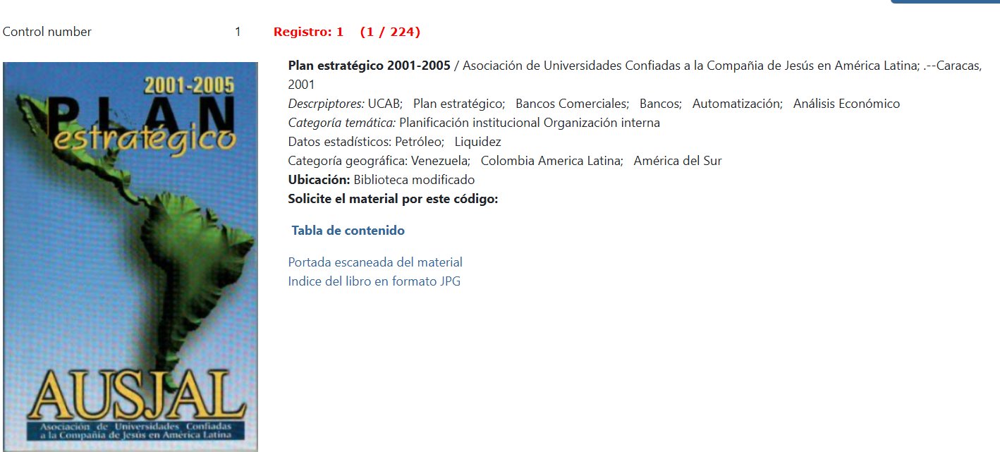
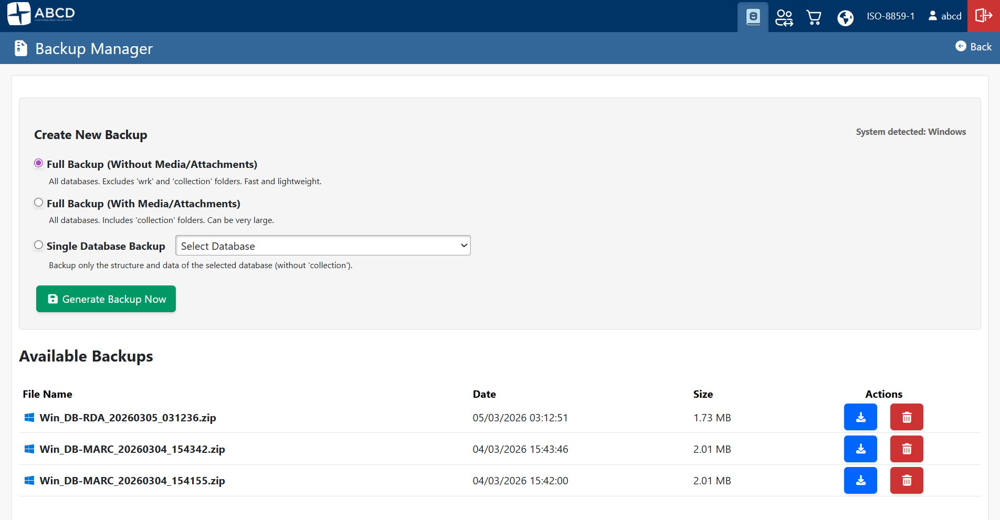
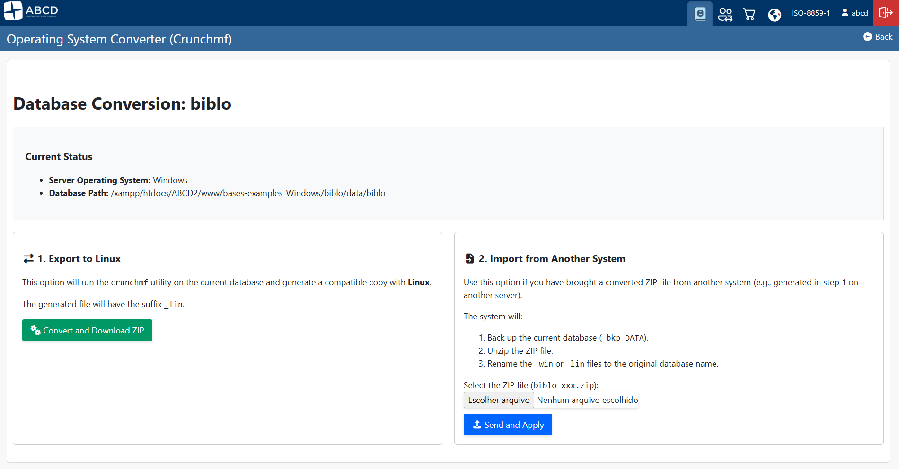
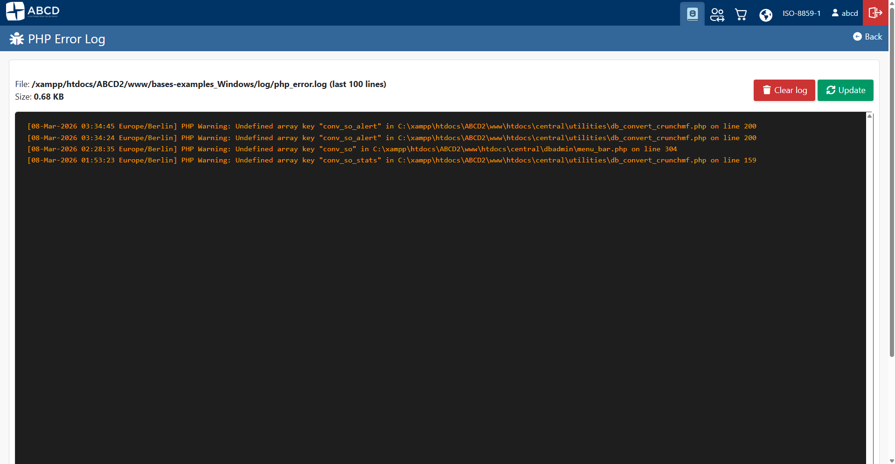

We are pleased to announce the release of **ABCD 3.3.0**. This release focuses heavily on hardening the codebase against security vulnerabilities, introducing native DevOps tools for system administrators, and improving PHP 8.x compatibility.

This post details the technical implementation of these features and the necessary server configurations for upgrading.

{/* truncate */}

## Security Hardening

### Digital Object Handling (`show_image.php`)
The mechanism for serving digital objects (images, PDFs) has been refactored to mitigate Path Traversal vulnerabilities and ensure stricter access control.



* **Session Validation:** The script now explicitly validates `isset($_SESSION["permiso"])` before serving any content, preventing unauthenticated access to restricted assets.
* **Path Traversal Prevention:** We introduced a strict check using `realpath()` to ensure the requested resource resides within the authorized base directory.
    ```php
    // Security implementation in show_image.php
    $base_dir = realpath($image_path);
    $real_requested_path = realpath($requested_path);

    if ($real_requested_path === false || strpos($real_requested_path, $base_dir) !== 0) {
        die("Access denied");
    }
    ```
* **HTTP_REFERRER Checks:** Added logic to validate the request origin, reducing the risk of hotlinking or CSRF attacks.

### Database Portability (`%path_database%`)
To facilitate containerization (Docker) and server migrations, we introduced the `%path_database%` wildcard variable. This allows the `dr_path.def` configuration to use relative paths instead of hardcoded absolute paths, decoupling the database configuration from the server filesystem.

## New System Administration Tools

Version 3.3.0 introduces three new PHP modules located in `htdocs/central/settings/` (or `dbadmin`), reducing reliance on shell access.

### 1. Native Backup Manager
**File:** `admin_backup.php`

**Path:** Configuration ABCD > Backup



This module implements a Zip-based backup strategy directly from the PHP interface. It utilizes the `ZipArchive` class and `RecursiveIteratorIterator` to handle directory traversal efficiently.

* **Storage Path:** Backups are strictly generated in `$db_path . "wrk/backups/"` to separate them from standard database operations and ISO exports.
* **OS Tagging:** The script detects the underlying OS via `PHP_OS` and prefixes the filename (e.g., `Lin_FULL_NOMEDIA...zip` or `Win_FULL...`). This is crucial for troubleshooting case-sensitivity issues during restoration.
* **Memory Management:** The script overrides execution limits using `set_time_limit(0)` and `ini_set('memory_limit', '1024M')` to handle large `collection` directories.

:::warning Prerequisite
The `php-zip` extension must be enabled in your `php.ini` for this module to function.
:::

### 2. Cross-Platform Database Converter (Crunchmf)
**File:** `db_convert_crunchmf.php`

**Path:** Select database > Menu Utilities > Export/Import > Operating System Converter (Crunchmf)



Migrating CISIS databases between Windows (Little Endian) and Linux (Big Endian) architectures typically requires command-line intervention. We have wrapped the `crunchmf` utility in a PHP interface to automate this.

* **Workflow:**
    1.  **Export:** Executes `$cisis_path/crunchmf source_db target_db_suffix`.
    2.  **Packaging:** Zips the resulting `.mst` and `.xrf` files immediately.
    3.  **Sanitization:** Cleans up temporary `.mst/.xrf` files after zipping to save space.
* **Import:** Automatically backs up the existing database (appends `_bkp_TIMESTAMP`) before overwriting with the converted version.

### 3. Server-Side Log Viewer
**File:** `admin_logs.php`

**Path:** Configuration ABCD > PHP Error Log



A robust viewer for PHP error logs has been added. It features a custom `tailCustom()` function that reads files from the **end** (using `fseek` and `SEEK_END`), allowing it to handle large log files without memory exhaustion.

## Configuration Requirements

### Enabling the Log Viewer
To make the Log Viewer functional, you must explicitly define the log path in your main `config.php`. The system expects logs to be written to `bases/log/`.

Add the following block to your `config.php`:

```php
// Sets the path to ABCD's own log folder.
$log_folder = $db_path . "log/";

if (!is_dir($log_folder)) {
    mkdir($log_folder, 0777, true);
}

$php_error_log = $log_folder . "php_error.log";

// Forces PHP to log errors to this specific file
ini_set('log_errors', 1);
ini_set('error_log', $php_error_log);

```

## UI/UX & OPAC Enhancements

* **Bootstrap Integration:** The OPAC now supports the CEPAL model database with a dedicated `opac.pft` template styled with Bootstrap.
* **PHP 8 Compatibility:** Polyfills for functions like `str_contains` have been added to the OPAC codebase to ensure compatibility with PHP 8.0+ environments.
* **Refactored Navigation:** The main configuration menu (`conf_abcd.php`) has been reorganized. The language selector was moved to the footer, and module buttons are now persistent.

## Upgrade Path

1. **Backup:** Perform a full file-system backup.
2. **Update Files:** Overwrite the `htdocs` directory with the 3.3.0 source.
3. **Dependencies:** Verify `php-zip` is installed.
4. **Config:** Update `config.php` with the logging directives shown above.
5. **Permissions:** Ensure the web server user has write permissions to `bases/wrk/` and `bases/log/`.

```