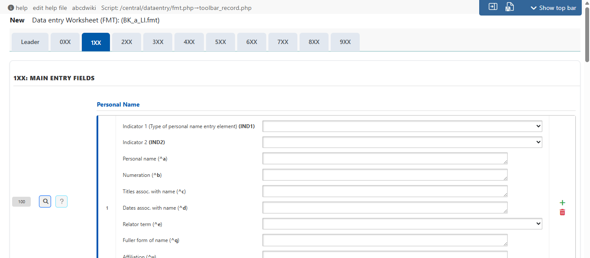
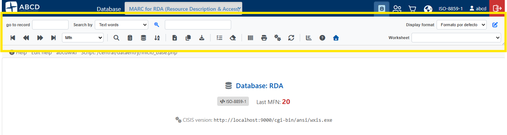
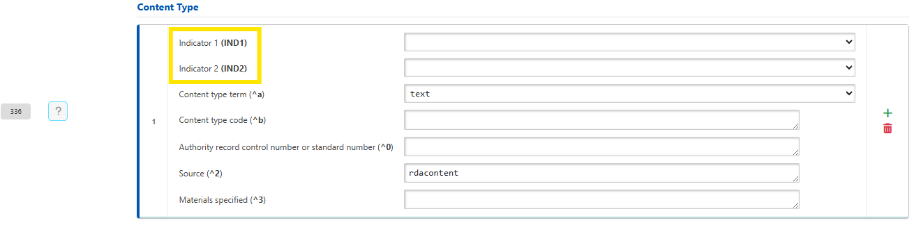
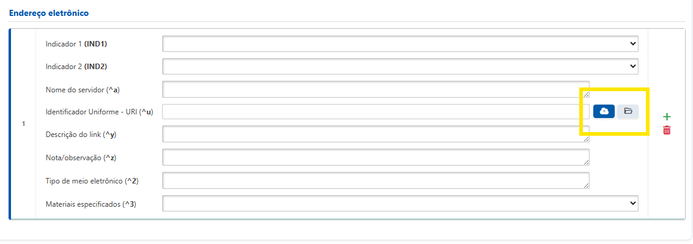
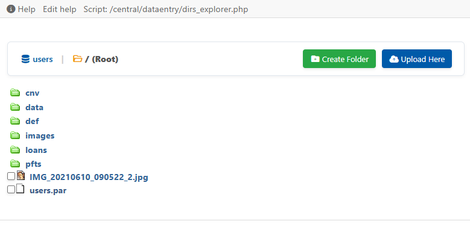
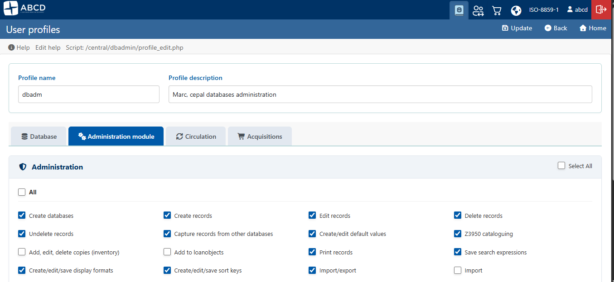
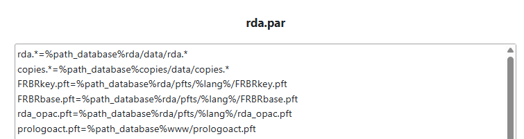
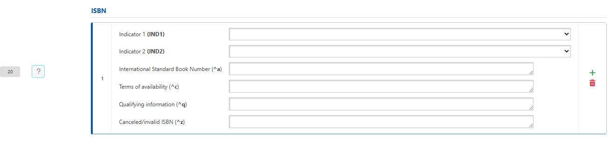

This release introduces deep structural updates to the core of ABCD, focusing heavily on modernizing the Data Entry (Cataloging) interface and ensuring compliance with international standards. ABCD v3.8 marks a significant milestone in transitioning from a traditional Integrated Library System (ILS) to a more modular Library Services Platform (LSP). The architecture has been refactored to be significantly more stable, developer-friendly, and fully prepared for future integrations via REST APIs.

#### 🚀 Key Features

**Data Entry Interface Modernization**

* **Native TAB Support in FDT:** Added support for the `TAB` field type to organize forms into distinct tabs. This enables the clean separation of form sections, completely replacing massive, single-page layouts that previously required gigantic accordions and endless vertical scrolling.

* **Removal of Legacy Dependencies:** The heavy and rigid dependency on the legacy `dhtmlX` library has been completely removed. The interface was rebuilt using semantic HTML and CSS Flexbox, resulting in a lighter codebase and much faster browser rendering.
* **Responsive Toolbar:** The global toolbar was redesigned into a responsive, two-tier layout. It maintains full support for core operations (including Quick Search, Formats, and Worksheets) while communicating seamlessly with the legacy iframe architecture.

* **Database Lock Resolution:** Resolved a critical, long-standing bug where database locks (`lock_db`) caused the global toolbar to freeze. Critical navigation functions—such as "Home" and "Admin/Config"—now remain accessible, allowing users to safely unlock databases without forced browser refreshes.
* **Dynamic Component Integration:** Restored the critical logic for "New Record" generation, ensuring that the system correctly detects and triggers the `typeofrecord.tab` workflow.

**MARC Standards & Interoperability**

* **MARC Indicator Support:** Added native support for the MARC Indicator (`IND`) field type within the FDT and validation engine. The system now permits having an Indicator 1 and a Subfield 1 within the same field, building fully MARC21-compliant strings.

* **Database Standardization:** Template databases for MARC and RDA (across English, Spanish, and Portuguese locales) have been standardized to conform to the new tab-based layout system.
* **File Normalization:** All `.par` and `.fst` configuration files have been standardized across example database models.

**Modernized File Management & Uploads**

* **AJAX-Driven Uploads:** Introduced a centralized upload system via `UploadRenderer` featuring a drag-and-drop modal, background AJAX processing, a visual progress bar, and full localization support.

* **Directory Management:** Users can now create target folders directly from the management interface, allowing files to be uploaded into exact subdirectories dynamically resolved by database paths.

**System Administration Enhancements**

* **Profile Editor Refactoring:** The user profile editor (`profile_edit.php`) was completely overhauled to modernize UI and JavaScript behaviors. The new layout incorporates tabbed navigation, dynamic accordions with real-time badge counts, and grouped checkbox grids for managing permissions across databases, formats, and worksheets.

* **Path Macros:** Added native support for the `%path_database%` constant within `.par` files, allowing administrators to point to relative paths for external databases directly from the core configuration (e.g., `rda.*=%path_database%rda/data/rda.*`).

* **Inline Subfields Toggle:** Introduced a new global configuration option `SUBFIELDS_INLINE` (Y/N) in the database settings to let administrators choose whether grouped subfields are displayed inline or managed via a pop-up window.

#### 🛠 Technical Refactorings (Under the Hood)

* **PFT Layout Modernization:** Refactored `pft.php` to replace table-based formatting with modern div/flex structures, while standardizing and simplifying client-side JavaScript functions.
* **Code Modularization:** Procedural field rendering logic in `dibujarhojaentrada.php` was completely replaced by a structured object-oriented architecture utilizing dedicated helper and renderer classes (*CalendarHelper, SubfieldHelper, RepeatableRenderer, etc.*).
* **Unified UI Indicators:** Embedded CSS loaders were replaced by a centralized, universal loading spinner component (`inc_wait.php`), reducing code duplication across background operations.
* **Print-Media Queries:** Implemented specialized CSS print-media queries for the statistics module, ensuring clean report generation by automatically hiding administrative panels during PDF export or printing.
* **Asset Integration:** Included the `Sortable.js` library to support seamless client-side drag-and-drop row reordering within the data entry module.
* **PHP 8.2 Compatibility:** Hardened array index validations and variable initializations across core scripts to ensure full compatibility with PHP 8.2 and prevent deprecation notices.
* **Atomic Concurrency Locks:** Automated record increment routines were refactored to use exclusive, atomic `flock()` execution on `control_number.cn`, preventing data corruption from race conditions during concurrent cataloging.

{/* truncate */}

## What's Changed
* Modernize pft.php layout and update back navigation by @rogercgui in https://github.com/ABCD-DEVCOM/ABCD/pull/644
* Modernization of the Data Entry Interface by @rogercgui in https://github.com/ABCD-DEVCOM/ABCD/pull/645
* New dataentry p2 by @rogercgui in https://github.com/ABCD-DEVCOM/ABCD/pull/646
* Refactor profile editor UI and add CSS styles by @rogercgui in https://github.com/ABCD-DEVCOM/ABCD/pull/647
* New dataentry p3 by @rogercgui in https://github.com/ABCD-DEVCOM/ABCD/pull/648
* Refactor interface, add %path_database% support by @rogercgui in https://github.com/ABCD-DEVCOM/ABCD/pull/649
* Update version.php by @rogercgui in https://github.com/ABCD-DEVCOM/ABCD/pull/650

**Full Changelog**: https://github.com/ABCD-DEVCOM/ABCD/compare/v3.7.0...v3.8.0