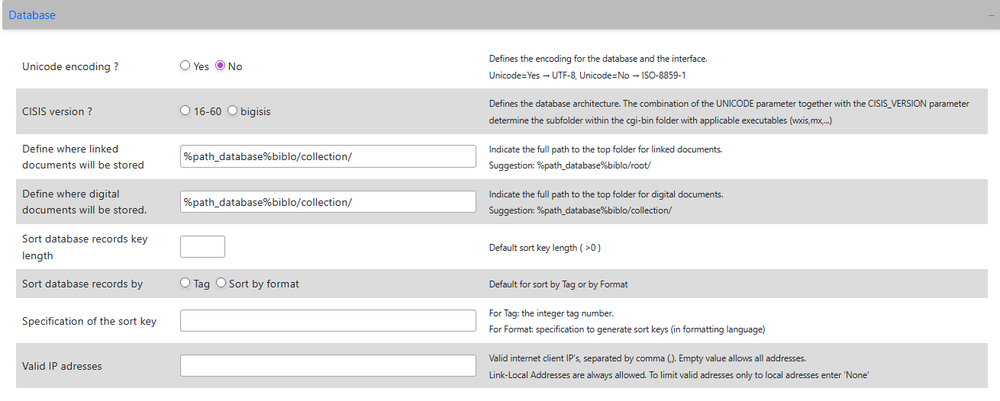

# Database IP Access Control

The ABCD allows you to restrict access to specific databases based on the client's IP address. This is particularly useful for databases that contain sensitive information or resources licensed exclusively for local network use.

**Script:** `inc_ip_check.php`
**Configuration File:** `bases/[db]/dr_path.def`

## How It Works

When a user attempts to access a database (for example, through `inicio.php`), the system checks the database's directory path definition file (`dr_path.def`) for a specific security parameter called `VALID_IP`.

* **Public Access:** If the `VALID_IP` parameter is not present in the file, the database is public and can be accessed from any IP address.
* **Restricted Access:** If the parameter is present, the system will block access unless the user's IP matches one of the allowed addresses.
* **Local Network Exemption:** By design, clients connecting from local network addresses (IPv4 `169.254.x.x` or IPv6 `fe80::`) are always allowed to access the database, bypassing the external IP check.

## Configuration (`VALID_IP`)

To enable this restriction, you must edit the `dr_path.def` file located in the specific database folder.

**File Location:** `bases/[db]/dr_path.def`

You can configure the allowed IPs using a comma-separated list or block all external access completely.

### Examples of Usage

**A. Allow Specific IP Addresses:**
Add the IPs separated by commas. Only these external IPs (plus the local network) will be granted access.
```ini
VALID_IP=192.168.1.100,203.0.113.45,203.0.113.46

```

**B. Block All External Access:**
If you want the database to be strictly internal and inaccessible to any external IP, use the `none` keyword.

```ini
VALID_IP=none

```

## Technical & Security Notes

* **Proxy Detection:** The script includes logic to detect the real IP address of the client even if the server is behind a proxy or load balancer. It checks headers such as `HTTP_X_FORWARDED_FOR` and `HTTP_X_REAL_IP` before falling back to `REMOTE_ADDR`.
* **Enforcement:** The `inc_ip_check.php` script provides the verification logic (returning `true` or `false`). The actual blocking action (showing a warning or denying access) is enforced by the scripts that call this function, such as the search initialization scripts.

---

## How to Configure via UI

You do not need to edit the configuration files manually. The ABCD Central module provides a direct graphical interface to manage these permissions.

**Step-by-Step:**
1. Log in to the **Central Module** of ABCD.
2. Select the target database from the main top-left dropdown menu.
3. On the main menu, click on **Update database definitions**.
4. Then, select **Advanced database settings (dr_path.def)**.
5. In the form that opens, ensure you are on the **Database** tab.
6. Scroll down to the bottom and locate the **Valid IP adresses** field.




## Configuration Options

In the **Valid IP adresses** field, you can define the access rules using the following formats:

* **Public Access (Default):** Leave the field **empty**. An empty value allows all client addresses to access the database.
* **Specific External IPs:** Enter valid internet client IPs separated by commas (e.g., `192.168.1.100,203.0.113.45`). Only these specified external addresses will be granted access.
* **Strictly Local Access:** Enter the word `None`. This blocks all external internet addresses, limiting access solely to local network addresses.

:::info Local Network Exemption
By design, clients connecting from Link-Local network addresses (IPv4 `169.254.x.x` or IPv6 `fe80::`) are **always allowed**, regardless of the restrictions applied in this field.
:::

## Technical Notes (Proxy & VPN)

* **Proxy Detection:** The underlying system script (`inc_ip_check.php`) is capable of detecting the real client IP even if your ABCD server is situated behind a proxy, load balancer, or CDN. It automatically checks HTTP headers such as `HTTP_X_FORWARDED_FOR` and `HTTP_X_REAL_IP` to validate the correct origin address.
* **Rejection Behavior:** If a user accesses the system from an unauthorized IP, the script flags the access as invalid, allowing the calling application (like the OPAC or Central portal) to display a warning and block the visualization of the restricted database.