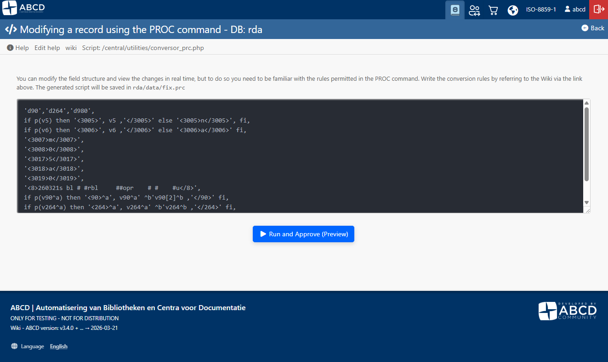
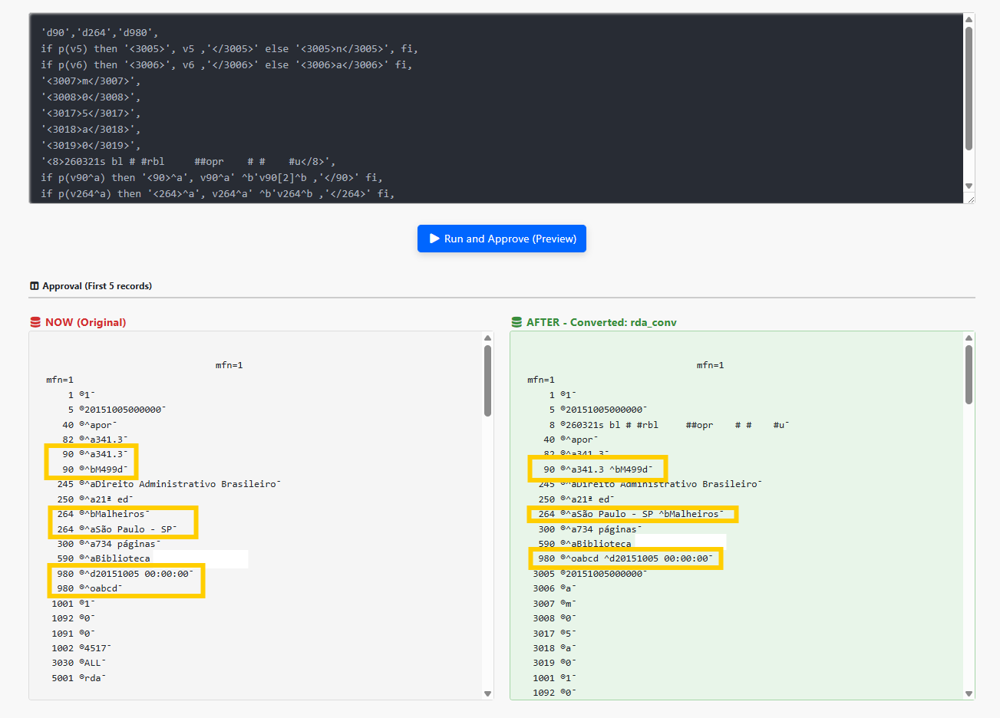

# Manipulating fields using the PROC command

ABCD and its underlying technology (CISIS) allow for extremely powerful data manipulation through formatting files and processing scripts (`.prc`). By using the `mx` utility and the `proc` function, it is possible to completely restructure the records of a database.

This page documents the **Interactive Conversion Interface** (which automates the application of PRC scripts) and provides the **Advanced Technical Reference** for building conversion rules and structuring MARC databases.

---

## 1. Interactive PRC Conversion Interface

Historically, massive data conversion (for example, after importing a delimited TXT or CSV file) required executing `mx` commands in the operating system's command line.

To streamline this workflow, ABCD provides an interactive post-migration web conversion interface. This tool allows database managers to test and apply conversion scripts visually and safely.
To access this, select a database from the home screen and click on **Utilities > Export/import > Modifying a record using the PROC command**.


### How to Use the Interface

The process is divided into three guided steps:

1. **Write the Conversion Script (PRC Rules):**
   * In the text editor box, enter the formatting language (PFT) rules that will dictate the modifications to the records.
   * The typed script is automatically saved to the `fix.prc` file within the database's data directory.




2. **Run and Preview (Homologation):**
   * Clicking the preview button does not alter your main database. Instead, it generates a temporary database (e.g., `rda_v1`).
   * The interface processes the **first 5 records** and displays them side-by-side in the Preview section:
     * **BEFORE (Original):** The record as it currently exists in the database.
     * **AFTER (Converted):** How the record will look after the script is applied.
   * This environment ensures that tags, subfields, and fixed positions are mapped correctly before affecting the entire collection.

   

3. **Commit Conversion:**
   * If the preview results are correct, the manager clicks **Commit Conversion to Main Database**.
   * **Safety:** The system automatically creates a backup of the original database (creating the `_ori.mst` and `_ori.xrf` files) and replaces the main files with the converted version.

---

## 2. Technical Reference: The `proc` Command and `fldupdat()`

The logic used in conversion scripts relies heavily on the `proc` function. The `proc` parameter allows you to specify, through a PFT format, modifications to be performed on the fields of the source record.

**Fundamental Concept:** Modifications are not made directly to the source database, but rather in memory or in the destination database. If a destination database is not specified, the changes might be seen on the screen but will be lost after execution.

### Limits and Recursion
* It is possible to specify up to **1024 `proc=` parameters** in a single MX command line.
* Each successive `proc` will act upon the record in its current state; meaning, if a previous `proc` modified the record, the next one will process the resulting data from that modification.
* A `proc` can be included inside another `proc` (recursive calls) without limits.

### Basic `fldupdat()` Syntax

Below are the commands natively accepted by the function governing `proc`:

| Command | Description | Example |
| :--- | :--- | :--- |
| **`d.`** | Logically deletes the record. | `proc='d.'` |
| **`d*`** | Deletes **all** fields in the record. | `proc='d*'` |
| **`dtt`** | Deletes all occurrences of the specified tag `tt` (e.g., Tag 26). | `proc='d26'` |
| **`dtt/occ`** | Deletes only a specific occurrence `occ` of the tag `tt`. | `proc='d26/3'` |
| **`att#str#`** | Adds the string `str` as a new occurrence of tag `tt`. The separator `#` can be any non-numeric character as long as it does not occur in the inserted data. | `proc='a999#cds#'` |
| **`htt n str_n`** | Adds the string `str_n` of length `n` (in bytes) to tag `tt`. | `proc='h99 8 CDS/ISIS'` |
| **`=<mfn>`** | Replaces the record number (MFN) with a new value `n`. | `proc='=10'` |
| **`s<tag>`** | Sorts the record's directory entries by the numeric tag. | `proc='s' proc='s70'` |

#### ⚠️ Golden Rules of `proc`
1. Within the same `proc` parameter, **all delete commands (`d`) must precede the add commands (`a`, `h`, etc.)**.
2. Do not use two or more delete commands by occurrence (`dtt/occ`) for the same field in the same call.
3. The `=` command (MFN substitution) and the `s` command should not be mixed with other commands in the same `proc`.

### Advanced Functions and Integrations

For complex migrations, CISIS offers extended syntaxes and database integration functions:

* **`<TAG>data</TAG>`**: Adds `data` as a new occurrence of the `TAG` field. This function allows the use of parameters to remove markup lengths (`stripmarklen`) and impose minimum lengths (`minlen`).
* **`x[append=]<mf>`**: Writes the data of the current record into the specified master file `<mf>`.
* **`r<mf>,<mfn>`**: Looks up the corresponding `<mfn>` in another database (`<mf>`) and includes its fields in the active record.
* **`g<gizmo_mf>[,<taglist>]`**: Applies a replacement database (Gizmo) over the record or over a specific list of tags.
* **`gsplit[/clean]=<tag>[=<criterion>]`**: Extracts and partitions fields into new occurrences based on separators (`char`), words (`words`), letters, numbers, or trigrams.
* **`gload` / `gdump`**: Used to load or extract binary files into/from a specific tag.

---

## 3. Practical Model: Building a Generic MARC Leader

By utilizing PFT conditional statements combined with the XML-style inclusion concept (`<TAG>data</TAG>`) understood by MX, it is possible to create advanced logic to migrate local fields to the **MARC 21** standard.

The practical script below illustrates the deletion of old fields (like `90`, `264`, `980`), the conditional inclusion of formatted variables, and the manual structuring of a generic Leader (Fixed Field 008) for migrated works.

```pft
'd90','d264','d980',
if p(v5) then '<3005>', v5 ,'</3005>' else '<3005>n</3005>', fi,
if p(v6) then '<3006>', v6 ,'</3006>' else '<3006>a</3006>' fi,
'<3007>m</3007>',
'<3008>0</3008>',
'<3017>5</3017>',
'<3018>a</3018>',
'<3019>0</3019>',
'<8>260321s bl # #rbl     ##opr    # #    #u</8>',
if p(v90^a) then '<90>^a', v90^a' ^b'v90[2]^b ,'</90>' fi,
if p(v264^a) then '<264>^a', v264^a' ^b'v264^b ,'</264>' fi,
if p(v980) then '<980>^o', v980^o' ^d'v980^d ,'</980>' fi,
```

**Structure Analysis:**
1. **Deletion Priority:** The instructions `'d90','d264','d980'` open the script, ensuring that the raw original data does not collide with the organized recreation of the tags.
2. **Fixed Definitions (`<8>`):** In tag `<8>`, the fixed-length field is assembled following the MARC guide for Dates, Country of publication (`bl`), Language, and Cataloging source. Placeholders and literals (like `s` for single date) are mapped in plain text.
3. **Conditional Mapping (`if p()`):** The script evaluates the existence of the variable; if it exists, the instruction wraps the complete tag with proper subfield formatting (e.g., `^a` and `^b`), while also respecting occurrences through array indices (e.g., `v90[2]^b`).

---

## 4. The XML `<proc>` Element

Beyond being used directly via scripts passed to `mx` in the conversion utility, the `proc` command can be invoked natively by ABCD in XML-structured architectures.

The `<proc>` element allows you to modify the content of the record currently loaded in memory, subjecting it to ISIS Formatting Language (PFT) rules.

Unlike the `<display>` element, which sends the output directly to the screen (browser) or a file, the `<proc>` element executes the PFT blindly and applies the results **internally** to the record's fields.

### XML Usage Rules
* **Allowed content:** The element must exclusively enclose `<pft>` tags.
* **Parent Elements:** `<do>`, `<function>`, `<hl>`, `<loop>`, `<section>`, `<update>`.

### XML Syntax and Example

Below is how the XML environment wraps the same formatting seen in `fix.prc` scripts:

```xml
<proc>
    <pft>PFT_INSTRUCTIONS_HERE</pft>
</proc>
```

In this example, the script processed by the XML deletes the original `2024` field and restructures its value by attaching a prefix 'a' and concatenating the content of field `2027` at the end, separated by `~`:

```xml
<proc>
    <pft>
        'd2024',
        'a2024~', v2024, '~', v2027, '~'
    </pft>
</proc>
```