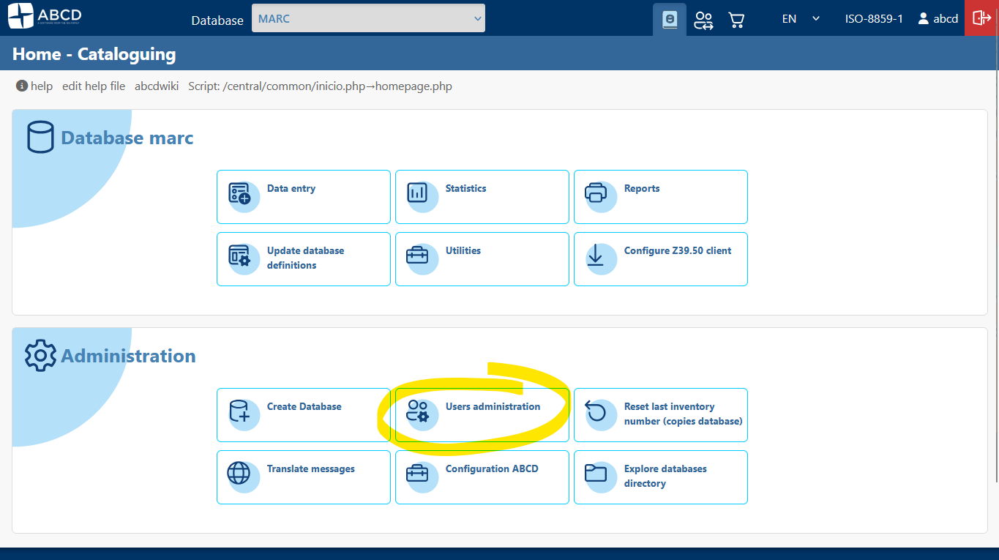

# Initial Setup and Next Steps

After completing the technical installation of ABCD, there are crucial configuration steps to perform before using the system in production. These steps ensure security and personalization.

## 1. Accessing the System

In version 3.1+, the access points have been reorganized:

* **Public Access (OPAC):** `http://localhost:9090`
    * This is what your library users will see by default.
* **Administrative Panel (Central):** `http://localhost:9090/admin`
    * This is where librarians and staff log in to manage the system.

*(The new administrative login screen)*

## 2. Change Administrator Password (Critical)

The default credentials are public knowledge. Keeping them represents a major security risk.

1.  Access the **Administrative Panel** (`/admin`).
2.  Log in with the default superuser:
    * **User:** `abcd`
    * **Password:** `adm`
3.  In the main menu, navigate to **Administration** > **User administration**.
4.  Click on the **User administration** icon.

5.  Locate the operator **abcd** in the list and click the **Edit** (pencil) icon.
6.  Enter a new, strong password in the "Password" and "Confirm password" fields.
7.  Click **Save**.

## 3. Customize Institution Identity

You should replace the generic ABCD logos and texts with your institution's branding.

1.  Go to **Administration** > **ABCD Configuration**.

2.  Select **System settings (abcd.def)**.

3.  Here you can modify:
    * **Institution Name:** Appears in headers and reports.
    * **Logo:** You can upload your library's logo file.
    * **URL:** The official website of your institution.

:::tip
Changes made here reflect immediately on the internal interface. For the OPAC customization, please refer to the **[OPAC Configuration](/docs/3.1/category/opac-public-catalog)** section in the documentation.
:::

## 4. Create Profiles and Operators

Avoid using the generic `abcd` superuser for daily tasks. Create individual accounts for your team.

1.  **Define Profiles:**
    * Go to **User administration** > **Create/edit profiles**.
    * Create roles like "Cataloger" (access to Data Entry only) or "Circulation Desk" (Loans only).
2.  **Create Users:**
    * Go back to **User administration**.
    * Click **New user**.
    * Assign a personalized username, password, and the appropriate **Profile**.

## 5. Next Steps

Now that your system is secure and personalized, you are ready to start:

* **[Creating your first Catalog](../quickstart/creating-first-catalog.md)**
* **[Configuring the OPAC](/docs/3.1/category/opac-public-catalog)**