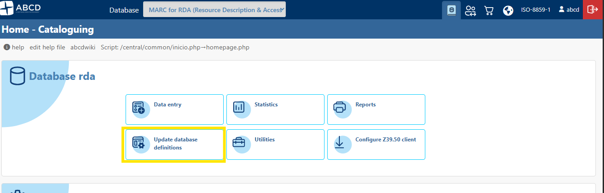
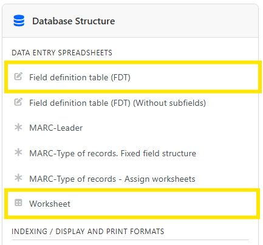
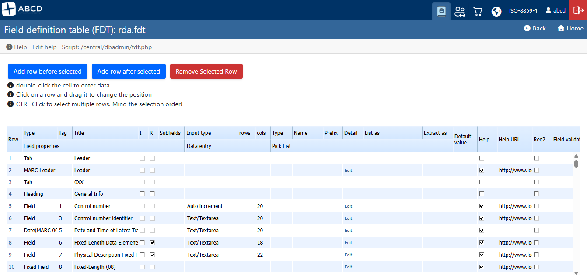
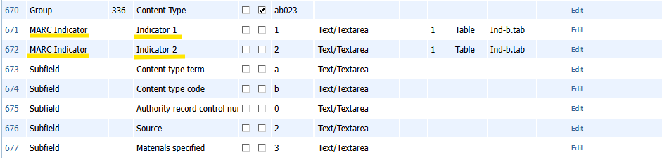
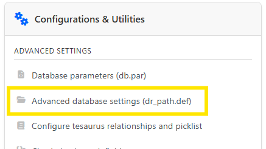
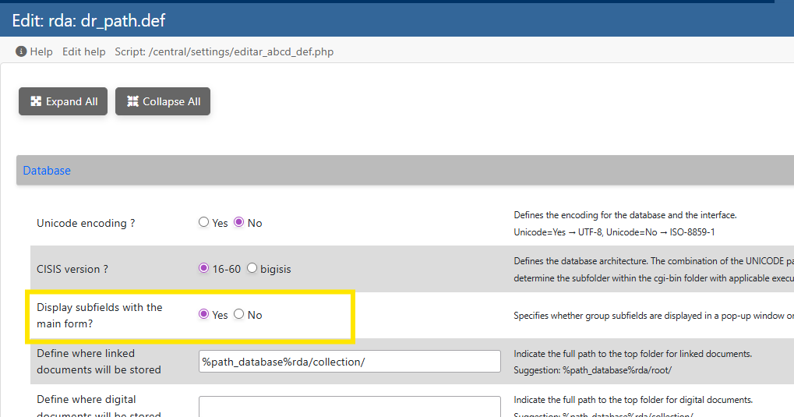
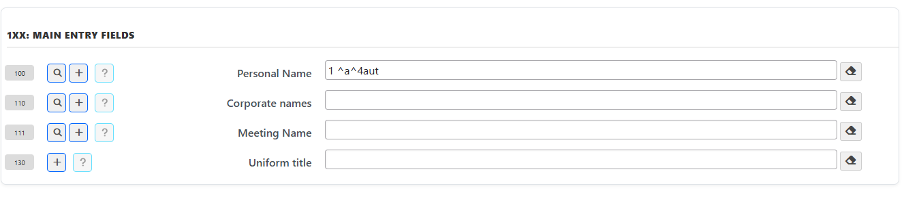
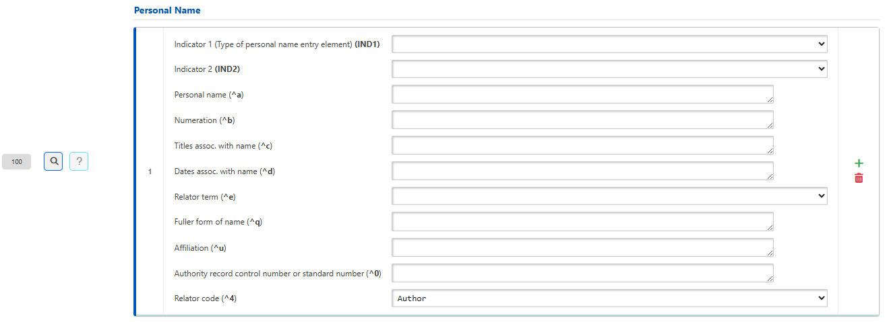
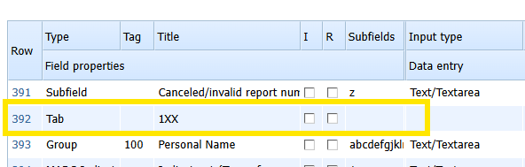

# Database Structure: FDT, FMT, and Advanced Cataloging Features

The flexibility and power of the ABCD Cataloging module rely on the ISIS database structure, managed natively through field definition tables. Unlike traditional systems based on rigid SQL tables, ABCD uses the **Field Definition Table (FDT)** and the **Data Entry Format (FMT)** to dynamically shape the cataloger's experience.

---

## 1. Field Definition Table (FDT)

The FDT defines the logical structure of the records, listing all available fields, their data types, and input rules. It determines what data can be stored and how the system will interpret each element.

* **Standard location on the server:** `bases/[db_name]/def/[language]/[db_name].fdt`

In the ABCD cataloguing module, select a database and click on **Update database definitions**, then click on **Field definition table (FDT)** if you wish to edit the database schema, or on **Worksheet** if you wish to edit a specific worksheet.



Next...



Next...



### Field Properties

When configuring a field in the FDT editor, the following essential columns and properties must be defined:

| Property | Description |
| :--- | :--- |
| **Row Type** | Identifies the nature of the element in the hierarchy (`T` for Main Field, `IND` for Indicators, `S` for Subfields). |
| **Tag** | The unique numeric identifier of the field (1-999). It does not need to be sequential. |
| **Name/Label** | The textual label displayed to the cataloger in the interface (e.g., "Title", "Imprint"). |
| **Repetitive** | Boolean (`0` or `1`) defining whether the field accepts multiple occurrences in the same record. |
| **Subfields** | List of valid delimiters that the main field accepts (e.g., `a_b_c` or `ab12`). |
| **Input Type** | Defines the visual rendering component of the field (Text, Textarea, Select, Upload, etc.). |
| **Size / Lines** | Determines the physical dimensions or the initial number of lines of the component in the interface. |

---

## 2. Data Types and Visual Components Matrix

The **Input Type** field in the FDT controls the behavior of the form element. Below are the legacy types and the new advanced components introduced in the updated architecture:

| Code | Technical Name | Interface Behavior |
| :--- | :--- | :--- |
| **T** | Simple Text | Single-line text input for standardized alphanumeric data. |
| **M** | Text Area (Memo) | Native textarea for large blocks of text, such as abstracts or general notes. |
| **D** | Date | Field with validation mask or calendar selector in ISO format. |
| **S** | Single Selection | Dropdown (`<select>`) fed by a choice table (`.tab` or `.pft`). |
| **X** | Variable Free Text | Flexible textarea. If configured without fixed lines, it assumes `rows="1"` and activates the native vertical resize handle. |
| **XF** | Fixed Text | Text input with rigid size and strict `maxlength` control directly on the subfield. |
| **IND** | MARC Indicator | Exclusive component to manage MARC 21 format indicators (detailed in Section 3). |
| **U** | Upload / Repository | Hybrid component with text input and action buttons for uploading and managing digital files (detailed in Section 5). |

---

## 3. Strict Configuration of MARC 21 Indicators (`IND` Type)

To map complex bibliographic fields in MARC 21, ABCD introduced the `IND` row type. This feature allows declaring the two indicators of the field immediately below the main `T` tag.

### Key Conflict Isolation (IND vs S Matrix)
In fields like **Tag 336 (Content Type)**, it is common for the structure to use numbers `1` and `2` both to designate the Indicator position and for actual data subfield codes (e.g., subfield `^1` for URI and subfield `^2` for Source).



To prevent subfield data from silently overwriting indicator selection tables in the system's memory, ABCD's internal architecture performs a composite key crossing (`TYPE_CODE`).

#### Example of FDT Configuration in the Editor:
```text
T|336|Content type|0|0|ab12|||||||||||0||0|0|||
IND||Indicator 1|0|0|1||X||1|P|Ind-b.tab|||||0||0|0|||
IND||Indicator 2|0|0|2||X||1|P|Ind-b.tab|||||0||0|0|||
S||Content type term|0|0|a||X|||||||||0||0|0|||
S||Control number|0|0|b||X|||||||||0||0|0|||
S||Real World Object URI|0|0|1||X|||||||||0||0|0|||
S||Source|0|0|2||X|||||||||0||0|0|||

```

When processing this table, the renderer internally separates the memory slots as `IND_1`, `IND_2`, `S_1`, and `S_2`. On the cataloging screen, indicators will be displayed with the highlighted suffix **(IND1)** and **(IND2)**, rendering their respective picklists in isolation and without conflicts, while the HTML preserves clean `data-subcode` attributes for the final record assembly.

---

## 4. Inline Subfields and Group Fields (`GroupRenderer`)

Up to version 3.7, ABCD only displayed the Groups (T) subfields via a pop-up window, but from version 3.8 onwards, the full field is available on the form, eliminating the need for extra clicks to enter data into the subfields.

This setting is not found in the data entry spreadsheet but in the database configuration menu under **Update database definitions** and **Advanced database settings (dr_path.def)**.




Locate the parameter **Display subfields with the main form?** and select **Yes** to enable the feature.



Repeatable fields and tags that aggregate multiple adjacent subfields are automatically processed by the **`GroupRenderer`** engine. This component optimizes visualization and eliminates excessively long vertical tables.

**Disabled subfield inline**



**Enabled subfield inline**




### Grid Features and Visual Behavior

* **Responsive Grid Distribution:** The renderer groups subfields into a flexible grid (`abcd-grid-3`), ensuring input elements are perfectly aligned side-by-side, respecting the size proportions defined in the database configuration file.
* **Dynamic Textarea Behavior (`X` Type):** When a subfield is configured as type `X`, the system checks for line parameterization (e.g., `5/100`). If none is found, it renders the element with `rows="1"`, applying the `resize: vertical; min-height: 28px;` style. This ensures vertical space savings while granting the cataloger the freedom to stretch the text box for extensive content.
* **Real-Time Synchronization (DOM):** All dynamically generated inputs trigger instant `onkeyup` and `onchange` events linked to the centralized `ABCD_updateHiddenTag()` function. Every character typed in an inline subfield invisibly updates the global form's hidden field, eliminating data loss prior to final saving.

---

## 5. File Upload and Server Explorer Module (`U` Type)

The **Upload** (`U`) field transforms a standard field or subfield into a management hub for digital objects linked to the database. The structure of this field was redesigned in version 3.8 to improve the user experience. 

In this version, you can drag an image into the Modal to perform the upload. You can also choose in advance which directory the uploaded file will be saved to.

Just like the enablement of inline subfields, this feature works in conjunction with the database’s dr_path.def file.

The `ROOT` parameter must be enabled for the files to be saved to the correct destination.

Example: %path_database%rda/collection/


### Component Control Structure

When declaring a field or subfield as type `U`, the interface automatically adds a row composed of a text input and two action buttons with contextual icons:

1. **Main Text Input:** Displays the relative path or name of the file linked to the record.
2. **Upload File Button (`abcd-btn-upload`):** Triggers an internationalized AJAX modal window allowing users to drag or select a local document to save directly on the database server.
3. **Explore Server Button (`abcd-btn-explore`):** Triggers the integrated file manager routine (`dirs_explorer.php`).

```html
<div class="subfield-input-container">
    <input type="text" id="tag500_0_a" class="inline-sub-input td" value="document.pdf">
    <div class="abcd-actions-gap">
        <button type="button" class="abcd-btn-upload" onclick="ABCD_openUploadModal('tag500_0_a')"><i class="fas fa-cloud-upload-alt"></i></button>
        <button type="button" class="abcd-btn-explore" onclick="SelectArchivo('tag500_0_a','forma1')"><i class="far fa-folder-open"></i></button>
    </div>
</div>

```

### Aesthetic Navigation in the Explorer (`../`)

The directory explorer script automatically cleans up path concatenation redundancies (avoiding visual artifacts like double slashes `//`). For deep databases, the return navigation uses the aesthetic indicator `../` to clearly denote that the user is viewing or moving one level up from the current storage folder, offering a cleaner and more familiar operating system experience.

---

## 6. Dynamic Tab System in Data Entry Worksheet

Highly extensive cataloging forms (such as complete worksheets for Monographs or Special Materials) generated visual fatigue and required excessive screen scrolling. ABCD solves this by implementing a data entry sheet divided into **Dynamic Tabs**.


To enable the tab system, simply select the **Tab** type between the field rows. This feature is available from version 3.8 onwards and is used to override the **Header** (`H`) type.



### Sticky Menu and Design Characteristics

* **Anchored Navigation (`position: sticky`):** The tab navigation bar (`.abcd-tabs-nav`) features smart floating behavior. When scrolling the page to read or fill out fields located at the bottom of the form, the tab bar automatically fixes itself to the absolute top (`top: 0`) of the viewing frame. The cataloger can switch sections at any time without needing to scroll the entire page back to the top.
* **Visual Isolation via CSS:** To ensure maximum readability, the floating menu has a high stacking index (`z-index: 100`) and a standardized solid background color (`background-color: #f8f8f8;`). This allows the form fields to slide cleanly underneath the fixed bar during scrolling, preventing text or visual elements from overlapping.
* **Automatic State Management:** Clicking on any tab dynamically alters the active DOM classes via JavaScript, hiding irrelevant sections and displaying only the elements linked to the selected tab, all without reloading the page and preserving the temporary state of edits.

`