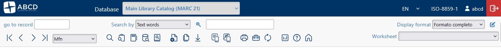

# Data Entry Workflow

The **Data Entry** window is the primary workspace for catalogers. It allows for the creation, modification, and deletion of bibliographic records in the selected database.

## The Data Entry Interface

When you open the Data Entry module, you are presented with two distinct toolbars: the **Main Header Toolbar** (horizontal top bar) and the **Record Toolbar** (floating or right-aligned actions specific to the record).

### 1. The Main Header Toolbar (`menu_main.php`)
Located at the very top of the workspace, this bar contains the **Navigation Controls** and global database tools.

**Navigation:**
These buttons allow you to browse through the Master File Numbers (MFNs).

| Icon | Action | Description |
| :--- | :--- | :--- |
|  | **First** | Go to the first record in the database. |
|  | **Previous** | Go to the previous record. |
|  | **Next** | Go to the next record. |
|  | **Last** | Go to the last record in the database. |
| **Browse By** | **Dropdown** | Toggle navigation between **MFN**, **Search Results**, or **Selected Records**. |

**Global Tools:**

| Icon | Action | Description |
| :--- | :--- | :--- |
|  | **Search** | Opens the main search dialog. |
|  | **History** | Shows the session search history. |
|  | **Thesaurus** | *(If enabled)* Opens the thesaurus for term selection. |
|  | **Free Search** | Opens the Google-like free text search. |
|  | **A-Z** | Browses the alphabetic index (dictionary). |
|  | **New** | Creates a new record (or uploads a document). |
|  | **Reports** | Opens the printing and reporting module. |
|  | **Maintenance** | Access to utilities (Import/Export, Unlock, Global Changes). |
|  | **Refresh** | Reloads the database context. |
|  | **Stats** | *(If enabled)* Generates database statistics. |
|  | **Help** | Opens the data entry help page. |
|  | **Home** | Returns to the database home page. |

---

### 2. The Record Toolbar (`toolbar_record.php`)
This toolbar appears near the record content (often floating on the right). It contains actions that affect **only the specific record** currently displayed.

| Icon | Action | Description |
| :--- | :--- | :--- |
| `Checkbox` | **Select** | Checkbox to add the current MFN to a "Selected Records" list for bulk processing. |
|  | **Edit** | Switches the record to Editing Mode. |
|  | **Copy** | Creates a duplicate of the current record. |
|  | **Refresh** | Reloads the current record (useful to see updates). |
|  | **Delete** | Deletes the current record (requires confirmation). |
|  | **Z39.50** | Search/Import via Z39.50 for this record. |
|  | **Validation** | Runs the validation rules on the current record. |
|  | **Copies** | *(If enabled)* Manage physical copies for this record. |

#### In Editing Mode
When you click **Edit**, the toolbar changes to provide save options:

| Icon | Action | Description |
| :--- | :--- | :--- |
|  | **Cancel** | Discards unsaved changes and exits edit mode. |
|  | **Save** | Saves the record to the database. |

### 1. Creating a New Record
1. Select the desired database (e.g., **Books**) from the top central menu.
2. Click the **New** ( ) icon.
3. **Select a Worksheet:** If the database supports multiple document types (e.g., Monographs, Serials, Maps), a dropdown will appear. Select the appropriate form.
4. The system will assign the next available **MFN** (Master File Number) automatically upon saving.

### 2. Editing an Existing Record
1. Use the **Search** (🔍) icon or the Navigation bar to find the record.
2. Click the **Edit** () icon.
3. The fields will become editable.

### 3. Filling in Data
ABCD uses specific conventions for data entry depending on the field definition (FDT).

#### Standard Text Fields
Simply type into the box. Use the `Enter` key to create new lines within a large text area (e.g., Abstracts).

#### Subfields (`^`)
ABCD uses the caret symbol `^` followed by a letter or number to define subfields (e.g., `^a`, `^b`).
* **Manual Entry:** You can type `^aBy Title^bSubtitle`.
* **Subfield Helper:** If configured, clicking the field name or a specific icon may open a form to fill subfields individually.

#### Repeatable Fields
Fields that can contain multiple values (like *Authors* or *Subjects*) are marked as "Repeatable".
* Click the **Add Occurrence** (`+`) icon next to the field to add a new empty line.
* Click the **Delete Occurrence** (`x`) icon to remove a line.

#### Picklists and Authority
* **Picklists:** If a field has a dropdown arrow or a list icon, click it to select from a standardized list (e.g., Languages: ENG, SPA, POR).
* **Authority Control:** If a field has a "Book" or "Search" icon, clicking it searches the linked authority database (e.g., Thesaurus) to ensure consistency.

## Saving Your Work
Once data entry is complete, click the **Save** () icon.
* If **Validation Rules** are active, the system may prevent saving if mandatory fields are missing or data formats are incorrect.
* A success message will confirm the record has been updated.

:::tip Understanding MFNs
The **MFN** is the internal ID of the record in the ISIS database. It is unique and permanent for that physical position in the file. It is different from the "Call Number" or "Accession Number," which are library-assigned identifiers.
:::