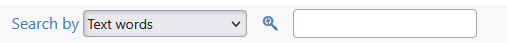
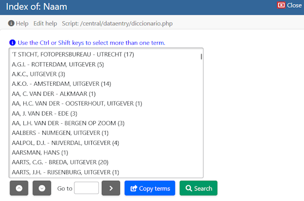
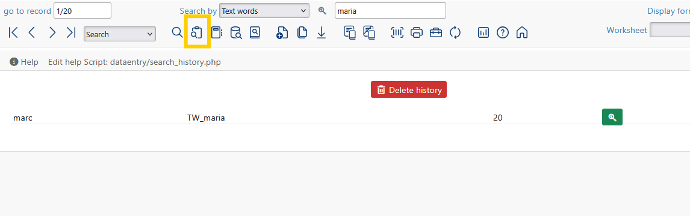
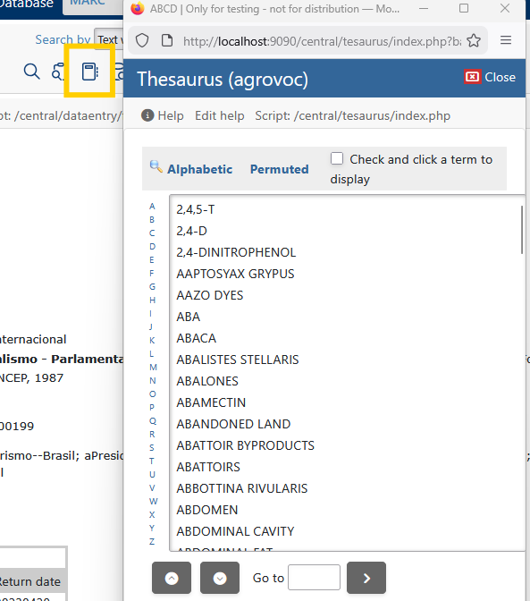
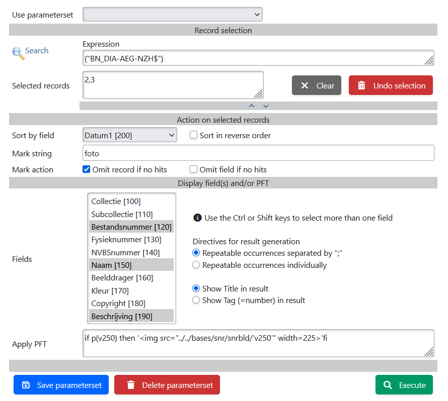
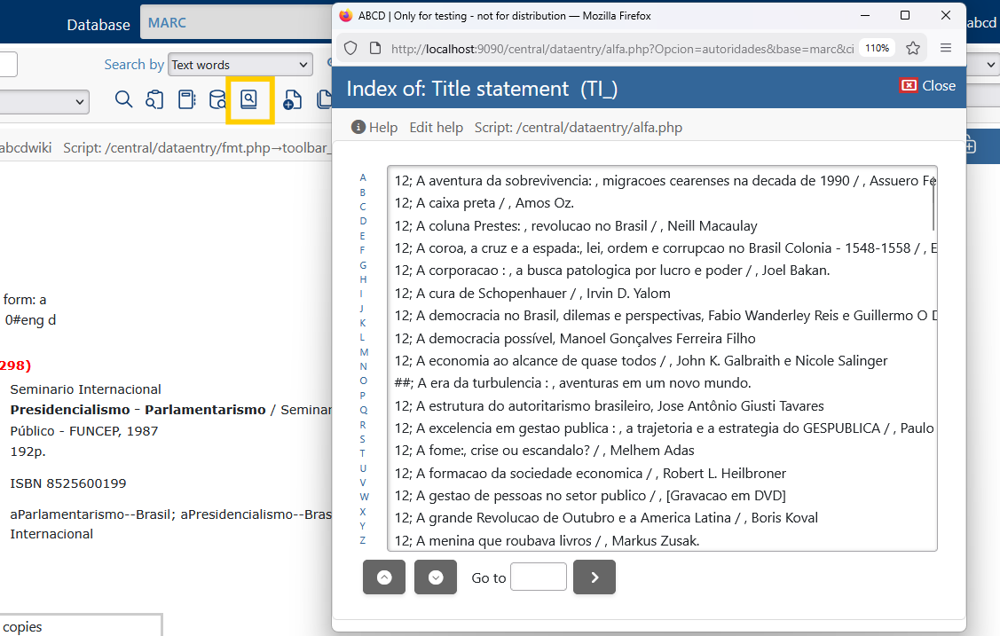

# Search and Retrieval Tools

The Cataloging module provides **6 distinct methods** to retrieve records. Each method is designed for a specific cataloging need, ranging from quick lookups to complex boolean queries and sequential text analysis.

---

## 1. Quick Search (Top Bar)
Located at the top of the cataloging interface, this is the fastest way to find a record if you know a specific identifier.

* **How it works:**
    1.  Select the **Index** from the dropdown menu (e.g., `Title`, `Author`, `Control Number`).
    2.  A click on the magnifier icon shows the index of the field.  
    Selecting a term from the index starts the search immediately
    2.  Manual entry in the text field is also possible.   
    Wild card and logical expression function the same as in the advanced search.  
    Hit return to start the search

* **Technical Note:** This sends a direct query to the CISIS Inverted File using the prefix defined in your FST (e.g., `TI_` for Title).

---

## 2. Search
**Icon:** 

The Search (defined by the `Advanced Search form`) provides a structured form for building complex queries using Boolean Logic (`AND`, `OR`, `NOT`).

**Features:**
* **Multiple Fields:** Combine different criteria (e.g., `Author="Asimov"` **AND** `Year="1980"`).
* **Saved Searches:** You can save complex queries to your user profile (via `busqueda_guardar.php`) to re-run them later.

 Details:

- The Field column shows all fields of the `Advanced Search form`. With the drop-down button another field can be selected. Allows reordering of the expression and duplicate terms in the expression.
- Note that Field = `- - -` allows arbitrary search expressions.
- Button `Index` shows the index of the terms for the current field in the [Index window](#index-window).
- The `Expression` may contain the dollar character `$` as last character of a string. Example: `myt$` means that any string starting with `myt` will match.
- The `Expression` may contain the strings **and**, **or**, and **not**. To build logical expressions.
- The `Expression` may contain groups, indicated by **(**…**)**
-  shows a pop-up to copy a stored expression.
- The last column contains the boolean operator between the expression fields (and, or, and not).

The bottom shows a button to `Search`, a button to `reset` the values in the form and a button to `Edit search expression previously stored`

### Index window

Options in the index window:
- Select one or more terms and `Search`. Performs the search immediately. Multiple terms are connected by **or**.
- Select one or more terms and `Copy terms`. Copies the term(s) to the search form. Multiple terms are connected by **or**.
- Type the first few characters  in the `Go to` box and `Enter`. Moves the list to the indicated term.

### Result window

- Search results are collected in a list that can be browsed.
- On top of this page the record toolbar is shown for all kinds of edits
- Button `Expression` can be used to modify/save the search expression

- The text of the search expression can be modified and button`Search` will execute the modified expression
- Button `Refine` shows [Search](#2-search)
- An expression can be saved by entering a name in `Description` followed by `save search expression`

A saved expression can be used by .
This shows a pop-up to copy a stored expression. 

---

## 3. Search History
**Icon:** 

Cataloging is repetitive. The **Search History** (`search_history.php`) keeps track of your recent activities.
- The shown history is for the current database.
- A click on the magnifier icon executes the query

---

## 4. Search with Thesaurus
**Icon:** 

If your system is connected to a Thesaurus database, this tool allows you to search using **Controlled Vocabulary**.

1.  Type a term (e.g., "Education").
2.  The system looks up the term in the Thesaurus.
3.  It displays relationships: **BT** (Broader Terms), **NT** (Narrower Terms), and **RT** (Related Terms).
4.  Selecting a term executes a search in the main catalog for that standardized descriptor.

---

## 5. Search,result in list
**Icon:**   
This search method is also called **Free Search** as it has powerful options to model the applied search and the resulting output. 

**Key Capabilities:**
* **Results in List:** Displays matches in a spreadsheet-like grid (defined in `freesearch_ex.php`), ideal for comparing records.
* **Mark string:** You can search for an arbitrary string within a chosen field (e.g., "Find 'Biology' inside Tag 650"). This allows you to find text in fields that are *not* indexed.

### Form components
A dropdown to use a `Saved parameterset`  
Click the name of a parameterset and all fields in the set will be copied to the form

#### Record Selection
Main goal of the record selection is to limit the number of results for the resulting list. This limits also the time to search for arbitrary strings.

Only one selection method can be used for the search
- By a standard search. See [Search](#2-search)  
Button Search` will copy the search expression to the form
- By using the MFN's of previously selected records.
This method is only shown if there are selected records. It is not possible modify the MFN numbers.
- By entering an MFN range  
This options is intended for checks and rarely used, so hidden during normal operation

#### Action on the selected records
- Sort by a selected field. Sort in reverse order is optional
- Mark a string. The entered string will be marked red in the text of the result list
- Action if the marked string is present in the results:
  - Omit record if no hits will still find the number of the search results, but records with no hits will not be displayed.
  - Omit field if no hits will omit displayed fields for a record if that field does not contain the Mark string

#### Display field(s) and/or PFT
This component determines the shown results.  
The shown Fields can be selected in the multiselect list. The radio buttons modify the content:
- Repeatable occurrences can be shown as a single line (concatenated and separated by a ";") or as multiple lines
- The text of a field is preceded by a field indicator. This is either the Title (e.g. "Collectie") or the tag (e.g. "100")

The field `Apply PFT` gives the option to show something extra in front of the standard selected Fields.
- Text example: `if p(v250) then v250 fi`
- Related picture example: `if p(v250) then ''fi`

#### Action buttons

Action buttons on the bottom of the form:
- Button `Save parameterset` is used to save a set. See Parameterset
- Button `Delete parameterset` is used to delete set. See Parameterset
- Button `Executes` the search, sorts and marks the results and shows the [Result form](#-result-form)

### Result form

Note the buttons on the right of the form:
-  Check box is used to add the record to the set of selected records. Equivalent to Check box in [Toolbar record](../data-entry.md#2-the-record-toolbar-toolbar_recordphp)
-  Shows the selected record in a pop-up window with the default display format. Each clicked record gets its own pop-up window. This allows to visually compare the complete records.

### Parameter set

The parametersets are administrated in file `<base>/pfts/<lang>/freesearch_save.tab`. Each line of this file contains the name of the parameterset and the values of the parameters 
- Button `Save parameterset` gives options to update an existing set or to create a new set
- Button `Delete parameterset` gives the option to delete an existing parameterset 

---

## 6. A-Z Dictionary Browse (`alfa.php`)
**Icon:**  (A-Z List)

This is the most precise retrieval method because it eliminates "zero results" due to typos. Instead of guessing a term, you browse the **Inverted File** (Index) directly.
A window is shown in which all records of the database are listed according to the field identified as the Identifier field in the Field Definition Table (FDT) (4th column I).
In bibliographic databases mostly the title field.

**Workflow:**
1.  Click the **A-Z** icon.
2.  **Browse:** The system displays a scrollable dictionary of terms actually existing in the database. In this list each alphabetic section can be clicked on to allow navigation in this normally large list. 
3.  **Select:** Click on a term to retrieve all linked records.
    * *Tip:* You can select multiple terms to perform an `OR` search (e.g., "Smith" OR "Smyth").

