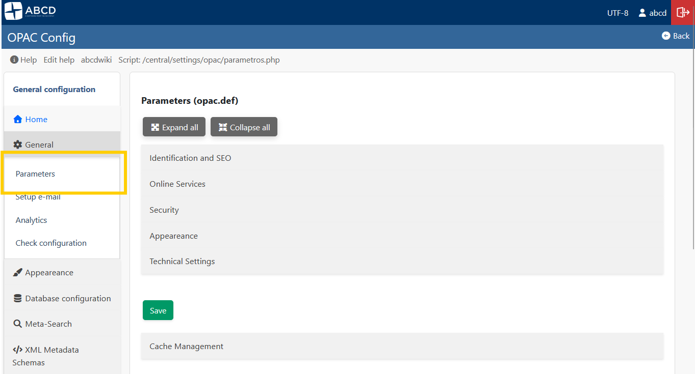
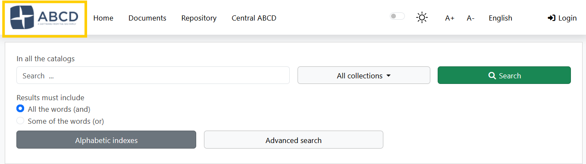
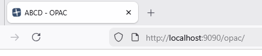
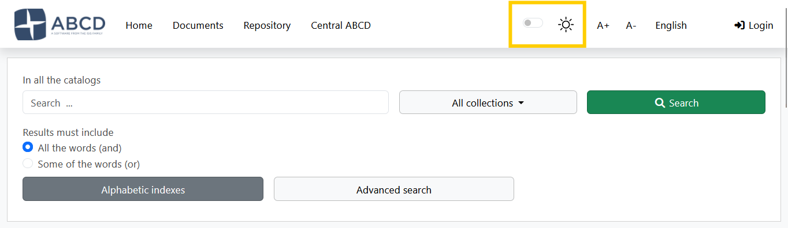
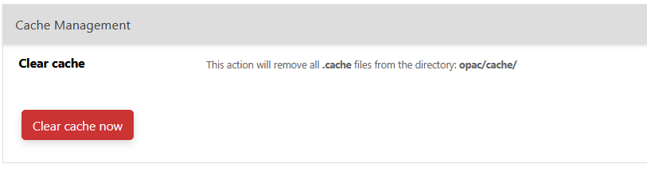

import Video from '@site/src/components/Video';

# System Architecture & Global Configuration

The ABCD OPAC is controlled by a hierarchy of configuration files. While advanced users can edit these files directly, the system provides a robust **Graphic Interface (GUI)** to manage global parameters, visual identity, and system cache.

<Video src="https://www.youtube.com/embed/0rhztRm5uTI" />

## 1. Global Parameters (GUI)
**Access:** **General** > **Parameters** (`parametros.php`)

This interface is the primary way to configure the behavior and look of your portal. It saves changes directly to the `opac.def` file without requiring manual text editing.



### Visual Identity
* **Logo:** You can upload an image file (PNG, JPG) directly through the interface to replace the site logo.


* **Favicon (ShortIcon):** Upload the small icon displayed in the browser tab.


* **Styles (CSS):** Select the color scheme (e.g., `styles.css`, `dark.css`) from the dropdown menu.


* **Link Logo:** Define the URL where users are redirected when clicking the logo (usually the library homepage).

### Content & Text
* **Page Title:** The text displayed in the browser's title bar (e.g., "Central Library Catalog").
* **Footer Text:** A short text line for copyright or contact info appearing at the bottom of every page.

### Security & Technical
* **CAPTCHA:** Enable Google reCAPTCHA integration to protect forms against bots.
* **Charset:** Select the character encoding (UTF-8 or ISO-8859-1).
    * *Note:* This must match your database encoding to avoid character display errors (like `ã`).

### Search Engine (Performance & Ranking)
To ensure system stability and prevent server timeouts (`max_execution_time`) when searching very large databases, the OPAC includes an intelligent **Relevance Gate**. Calculating keyword relevance across tens of thousands of records is highly CPU-intensive. This mechanism limits heavy text-scoring algorithms on massive result sets while ensuring the total number of hits remains accurate.

Here is what each parameter controls:

* **`RELEVANCE_GATE_ENABLED` (Y/N):** 
  Activates the volume protection mechanism. When set to `Y`, the system will monitor the total number of results found before attempting to score them.
* **`RELEVANCE_MAX_SCORED` (Integer):** 
  The threshold limit (default is `3500`). If a broad search returns more records than this limit, the system bypasses the heavy relevance scoring and performs a fast fallback sort by MFN (chronological order of entry). 
  *Important:* This does **not** hide records or truncate the total count. The user will still see the exact total (e.g., "12,015 records found"), but a transparent warning message will appear suggesting they refine their search with more specific keywords to enable relevance ranking.
* **`RELEVANCE_CACHE_ENABLED` (Y/N):** 
  Enables the temporary storage of the heavy sorting operations for search results. This drastically speeds up pagination, sorting changes, and format switching within the same search session by preventing the server from recalculating the entire array on every page click.
* **`RELEVANCE_CACHE_TTL` (Integer):** 
  Cache Time-To-Live in seconds (default is `300`, which equals 5 minutes). Determines how long the sorted cache remains valid before the system discards it and forces a fresh database query.

---

## 2. Cache Management
**Access:** **Global Parameters** > **Cache Management** (Bottom of the page)

To improve performance, the OPAC caches search results (including relevance scoring arrays), facet calculations, and configuration arrays in the `opac/cache/` directory.

### When to Clear Cache?
You should click the **"Clean Cache"** button if:
1.  You made changes to `opac.def` or `bases.dat` that are not appearing.
2.  You updated a PFT format, but records still show the old layout.
3.  The OPAC seems "stuck" on old search results after a massive database update.



* **Action:** The system deletes temporary files (`*.cache` and temp text files) ensuring that the next user request generates fresh data.

---

## 3. The Backend: `config_opac.php` & `opac.def`
Although the GUI handles most daily tasks, understanding the underlying files is crucial for troubleshooting and advanced architecture.

### The Bootloader: `config_opac.php`
Located in the root of the OPAC, this script initializes the environment.
* **`$db_path`**: The absolute path to the `bases` folder.
* **`$lang`**: The priority logic for language detection.
* **`$restricted_opac`**: Defines if the portal requires login (`Y`) to view the home page.

### The Configuration File: `opac.def`
The GUI described above writes to this INI file located in `bases/opac_conf/opac.def`.

**Example Content:**
```ini
[OPAC]
OpacHttp=http://localhost:9090/opac/
Logo=logoabcd.png
link_logo=[http://my-library.org](http://my-library.org)
TituloPagina=My Library Catalog
footer_text=© 2024 Library Systems
styles=styles.css
CAPTCHA=Y

; Search Engine Performance
RELEVANCE_GATE_ENABLED=Y
RELEVANCE_MAX_SCORED=3500
RELEVANCE_CACHE_ENABLED=Y
RELEVANCE_CACHE_TTL=300

```

:::warning 
URL Configuration
The parameter **`OpacHttp`** is critical. It must match your server's public URL exactly. If images break or AJAX searches fail, check this value in the file manually.
:::

---

## 4. The `opac_conf` Directory Structure

The `bases/opac_conf/` folder contains the "Global Configuration" assets that apply to all databases.

* **`bases.dat`**: The master list of databases available in the OPAC.
* **`lang.tab`**: Maps language codes (en, es, pt) to human-readable names.
* **`formatos.dat`**: Defines the output options (ISO, Word, Print) available in the toolbar.
* **`record_toolbar.tab`**: Controls which icons appear above records (Print, Reserve, etc.).

```
