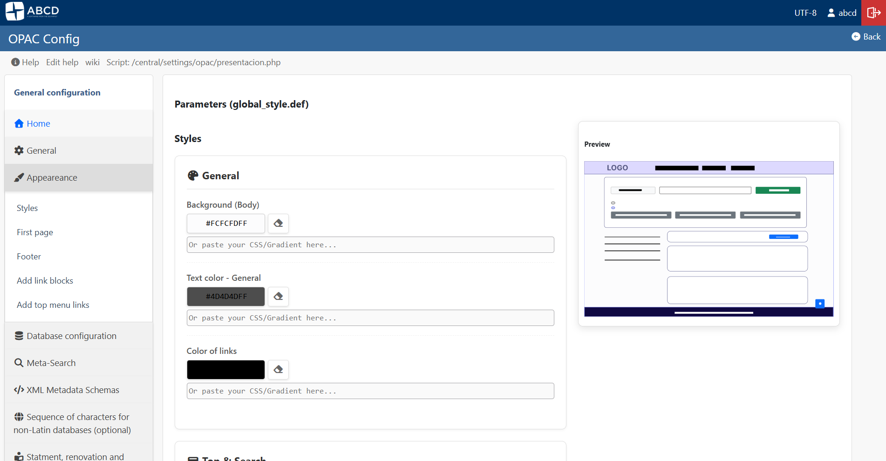

# Visual Appearance, Colors, and Layout

The **Appearance** module (`presentacion.php`) is a visual tool designed to help administrators define the color palette and layout structure of the OPAC. It features a modern, split-screen interface with a **Live Preview** system using an SVG simulation, alongside advanced options for CSS styling and layout configuration.

**Access:** **OPAC Configuration** > **Appearance**

## 1. The Customization Interface

The screen is divided into two main areas:

### A. Configuration Panel (Left)
On the left side, you will find controls to define colors, layout options, and CSS for specific interface elements.

**Customizable Elements (Colors & Gradients):**
* **Navigation Bar (Top):** Background color of the top menu.
* **Buttons:** Colors for primary actions (Search, Login), secondary actions, and submit buttons.
* **Text & Links:** Definition of the base font colors and link highlights.
* **Footer:** Background and text colors for the bottom section.
* **Search Bar:** Highlights and background for the main search area.

**Layout & Structure Options:**
* **Search Bar Style:** Choose between a prominent centered search (*Hero Search*) on the homepage or a permanently fixed bar at the top (*Sticky-Top*).
* **Fat Footer & Institutional Menu:** Move institutional links (the former sidebar menu) to the Footer (*Fat Footer*), leaving the left sidebar exclusively for search **Filters and Facets**.

### B. Live Preview (Right)
On the right side, the system displays a schematic representation (SVG) of the OPAC layout.
* **Real-Time Feedback:** As soon as you pick a color or type a gradient on the left, the corresponding element in the SVG updates immediately.
* **No Reload Needed:** This allows you to experiment with different combinations without reloading the page or saving the changes.

## 2. Managing Colors and Gradients

The system uses a smart "Dual Input" approach to ensure maximum flexibility in styling:

### Picking a Solid Color
1. Click the color box next to the element you want to change.
2. A Color Picker will appear.
3. Select the desired shade, and the Hexadecimal code will be filled automatically.

### Inserting Gradients or Advanced CSS
For complex backgrounds (e.g., `linear-gradient(...)` or `url(...)`):
1. Type or paste your CSS code directly into the advanced text field ("Or paste your CSS/Gradient here...") below the color picker.
2. The system will automatically override the solid color and update the interface with your pure CSS.

> **💡 Pro Tip: Generating Gradients**
> Writing CSS gradients from scratch can be tricky. We recommend using free online tools to generate the perfect visual effect and simply copy-pasting the resulting CSS code into the OPAC configuration:
> * [CSS Gradient](https://cssgradient.io/)
> * [ColorZilla Gradient Editor](https://colorzilla.com/gradient-editor/)

### Restoring Defaults
If you make a mistake or want to revert a specific field to its original state:
* Click the **Eraser Icon** (<i class="fas fa-eraser"></i>) located next to the input field.
* This restores the original default color defined by the system.

## 3. Custom CSS Injection

For advanced users who need customizations beyond the default colors, the module features a built-in code editor at the bottom of the page.
* **How it works:** Any CSS rule written in this block is saved into an independent file (`custom.css`), which is loaded last in the OPAC.
* **Advantages:** This allows you to easily override the default theme's design rules (e.g., changing border radii, font sizes, or specific margins) safely, without modifying the system's core source code files (`.css` or `.php`).

---

## 4. Technical Details: The `global_style.def` File

Behind the scenes, the OPAC stores your appearance and layout choices in a configuration file. Understanding this file is useful for system administrators performing manual backups, migrations, or bulk edits.

* **Location:** `[db_path]/opac_conf/global_style.def`
* **Format:** Standard INI format (`KEY=VALUE`). Values containing CSS functions (like `linear-gradient`) may be wrapped in quotes to prevent parsing errors.

### Available Parameters

Below is the list of parameters managed by this file:

**General Colors**
* `COLOR_BG`: Main background color.
* `COLOR_TEXT`: Main text color.
* `COLOR_LINKS`: Color for hyperlinks.

**Header & Search**
* `COLOR_TOPBAR_BG` / `COLOR_TOPBAR_TXT`: Background and text colors for the top navigation bar.
* `COLOR_SEARCHBOX_BG`: Background color of the search box container.

**Buttons**
* `COLOR_BUTTONS_PRIMARY_BG` / `COLOR_BUTTONS_PRIMARY_TXT`: Primary buttons (e.g., main actions).
* `COLOR_BUTTONS_SUBMIT_BG` / `COLOR_BUTTONS_SUBMIT_TXT`: Submit buttons (e.g., search execution).
* `COLOR_BUTTONS_SECONDARY_BG` / `COLOR_BUTTONS_SECONDARY_TXT`: Secondary/cancel buttons.
* `COLOR_BUTTONS_LIGHT_BG` / `COLOR_BUTTONS_LIGHT_TXT`: Light/ghost buttons.

**Content & Footer**
* `COLOR_RESULTS_BG`: Background color of the individual record cards in the results list.
* `COLOR_FOOTER_BG` / `COLOR_FOOTER_TXT`: Background and text colors for the footer.
* `COLOR_TOTOP_BG` / `COLOR_TOTOP_TXT`: Background and text colors for the "Scroll to Top" floating button.

**Layout Configurations**
* `TOPBAR`: Defines the search bar behavior (e.g., `default`, `hero`, `sticky-top`).
* `CONTAINER`: Sets the Bootstrap container type (e.g., empty for fixed, `-fluid` for full width).
* `SIDEBAR`: Defines the sidebar behavior (`SL` for Standard Left, `R` for Right, or `N` to hide).
* `hideFILTER`: Determines if the facet filters should be hidden (`Y` or `N`).
* `NUM_PAGES`: Number of pagination links displayed at the bottom of the search results.