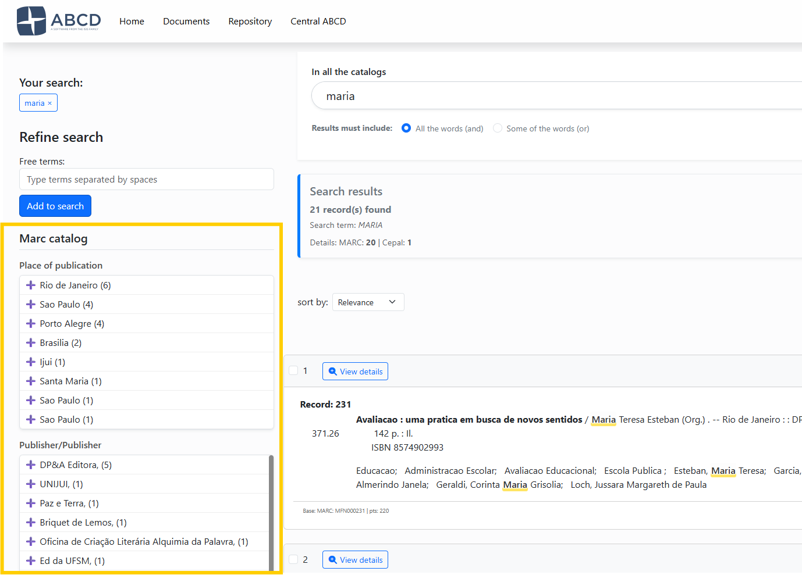
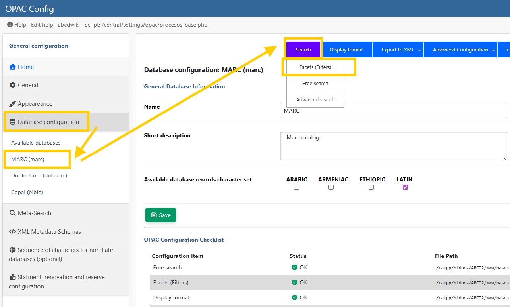

# Facets Configuration

Facets are the side filters that appear after a search (e.g., "Filter by Year", "Filter by Author"). They allow users to refine a broad search into a specific set of records by grouping results based on common values.




Script for creating facets:
* **Script:** `facetas_cnf.php`
* **File Created:** `bases/[db]/opac/[lang]/[db]_facetas.dat`

## 1. How Facets Work
Facets rely on a combination of the **Inverted File (Index)** for counting and the **Master File** for display.
* **Prerequisite:** You cannot create a facet for a field that is not indexed in the database's **FST** (Field Selection Table).
* **Technique:** Ideally, fields used for facets should be indexed using **Technique 0 (Line)**.

To edit the facets, go to the ABCD Settings menu -> OPAC -> Under "Databases," select one of the available databases -> Click on the database, then in the top menu, under “Search,” locate "Facets."




## 2. Configuration Columns

The configuration file is a pipe-delimited text file where each line represents a facet box. The interface allows you to define 4 specific columns:

| Column | Name | Description | Example |
| :--- | :--- | :--- | :--- |
| **1** | **Label** | The title of the facet box displayed to the user. | `Authors` |
| **2** | **Extraction Format** | A mini-PFT (ISIS Format) to extract the value from the record. **Crucial:** Use `/` at the end to handle repetitive fields correctly. Use parentheses ( ) if it is a repetitive field, that is, one that contains more than one instance of the same information. | `(v100^a/)` |
| **3** | **Prefix** | The FST prefix used to filter the search when the user clicks a term. | `AU_` |
| **4** | **Sort Order** | Defines how the terms inside the facet box are sorted.<br/>**Q**: By Quantity (Highest count first).<br/>**A**: Alphabetical order (A-Z). | `Q` |

## 3. Configuration Example
Below is a typical configuration for a MARC database (`marc_facetas.dat`).

```text
Place of Publication|v260^a|PA_|Q
Publisher|v260^b|ED_|Q
Year|v260^c|DA_|A
ISBN/ISSN|v20^a|IS_|Q
Personal Author|v100^a/|AU_|Q
Institutional Author|v110^a/|AI_|Q
Title|v245^a|TI_|Q
Subject (Topic)|v650^a/|MA_|Q

```

### Analysis of the Example:

* **Row 5 (Personal Author):**
* **Label:** "Personal Author"
* **Format:** `v100^a/` (Extracts subfield `^a`. The `/` ensures that if a book has 3 authors, 3 separate lines are generated).
* **Prefix:** `AU_` (Matches the FST index).
* **Sort:** `Q` (Shows the most prolific authors at the top).
* **Row 3 (Year):**
* **Sort:** `A` (Alphabetical/Numerical). This is better for dates, so the years appear as 1990, 1991, 1992, rather than by popularity.

For facets to work, the output format—that is, the format that generates the link in the facet blocks—must have the same structure as the data in the index.
If you configure the display to show “Last Name, First Name” with the prefix AU_, and this is a combination of a field and a subfield, the FST must be indexed as “AU_Last Name, First Name”.

:::danger Warning!
The | pipe character, used for concatenation in the FST, does not work in the facet display format. 

Therefore, if the FST contains:
`(|AU_|v160^*,|, |v160^b,'%'/)`
In the facets, the pipe must be replaced with `'` (single quotes), so the format becomes:
`(|AU_|v160^*,', 'v160^b,/)`
Remove the percent sign as well; it does not work as a display format.
:::

## 4. Helper: The FST Viewer

To assist you, the configuration script includes a panel at the bottom ("View FST Help").

1. Open the panel to see your `[base].fst`.
2. Identify the **Prefix** (e.g., `AU_`) corresponding to the field you want to facet.
3. Copy that prefix into the 3rd column of your configuration.

:::tip Repetitive Fields
If a field is repetitive (like **Subjects** or **Authors**), you **must** include the slash `/` at the end of the extraction format (e.g., `v650^a/`). If you omit it, ABCD will concatenate all subjects into a single long string.
:::

