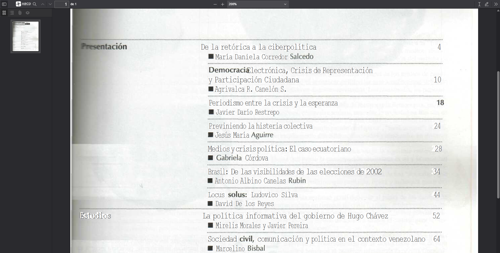

ABCD includes an integrated PDF viewer based on the **PDF.js** library. This component allows users to read documents directly within the browser (OPAC) without needing external plugins (like Adobe Reader) and without forcing an immediate download of the file.



## Overview

The viewer is located at: `opac/viewer/index.php`.

Unlike the Image Viewer (`show_image.php`), which processes files on the server-side, the PDF Viewer works primarily on the **client-side** (in the user's browser).

:::info Technical Note
Because this viewer runs in the browser using JavaScript, **it ignores the `ROOT` parameter** defined in `dr_path.def`.
The viewer requests the document via a standard HTTP request. Therefore, the file path provided must be **web-accessible** (a valid URL relative to the ABCD installation).
:::

## Usage in PFT

To link a bibliographic record to its digital document, you usually store the relative path in a field (e.g., `v856`). You can then create a link in your display format (PFT) that opens the viewer.

### Syntax

The viewer accepts the `pdffile` parameter (or `file` in standard PDF.js builds) to specify the document to load.

**URL Structure:**
`/opac/viewer/index.php?pdffile=[REL_PATH_TO_PDF]&base=[DB_NAME]`

### Example PFT

Assuming field **v856** contains the path `collection/text/report_2024.pdf`:

```pft
/* Link to open PDF Viewer */
(if p(v856) then 
    '<a href="/opac/viewer/index.php?pdffile='v856'&base=biblo" target="_blank" class="btn btn-outline-primary">'
        '<i class="fas fa-file-pdf"></i> View Document'
    '</a>' 
fi)

```

## Configuration & Behavior

### Path Resolution

Since the viewer "ignores" the server-side `ROOT` configuration, the path stored in your database must be relative to the OPAC's web root or the viewer's execution context.

* **Correct:** `collection/docs/file.pdf` (If the `collection` folder is inside the web root).
* **Incorrect:** `c:/abcd/bases/collection/file.pdf` (Local server paths are not accessible by the browser).

### Security vs. Usability

The PDF.js viewer provides a seamless reading experience ("Streaming" the PDF).

* **Download Button:** The default interface includes a download button.
* **Direct Access:** Even if you hide the download button via CSS, knowledgeable users can still download the file because the browser must download the PDF data to render it.

## Third-Party Library: PDF.js

This viewer is built upon **PDF.js**, a general-purpose, web-standards-based platform for parsing and rendering PDFs. It is an open-source project maintained by the Mozilla community.

If you need to customize the viewer's toolbar, icons, or rendering behavior, you are essentially modifying the PDF.js default viewer.

### References & Resources

* **Official Repository:** [Mozilla PDF.js on GitHub](https://www.google.com/search?q=https://github.com/mozilla/pdf.js)
* **Project Website:** [mozilla.github.io/pdf.js](https://mozilla.github.io/pdf.js/)
* **License:** Apache License 2.0
* **Capabilities:**
* Renders PDF content to HTML5 Canvas.
* Supports text selection and search within the document.
* Supports sidebar navigation (chapters/outlines).
* Responsive design for mobile and desktop.


:::tip Customization
The interface files for the viewer are located in `opac/viewer/`. The main logic resides in `viewer.js`, and the styling is in `viewer.css`. Any changes to these files should be carefully tested against official PDF.js updates.
:::

```
