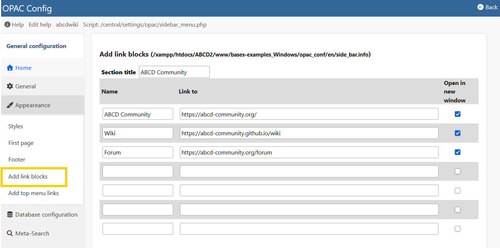

# Content & Layout Management

The ABCD OPAC acts as a lightweight Content Management System (CMS). Instead of storing page content in a database, it uses small HTML snippets (extension `.info` or `.html`) located in `bases/opac_conf/[lang]/`.

You can edit these files via the **OPAC Configuration** interface or directly with a text editor.


## 1. The Home Page (`home_1.html`)
The main area of the landing page is not hardcoded. It loads `home_1.html` (or `home_2.html`, etc., if configured).

* **Usage:** Use this file to add welcome messages, library news, carousels, or links to external services.
* **Format:** Standard HTML. You can use Bootstrap classes (e.g., `<div class="alert alert-info">`) since the OPAC loads Bootstrap by default.

## 2. Sidebar Widgets (`side_bar.info`)
The sidebar (usually on the left or right) is constructed from the `side_bar.info` file.



**Syntax:**
```text
Heading Title
[LINK]Label|URL|target
[HTML]<div class="widget">Custom Content</div>

```

* **Links:** Create simple navigation menus.
* **HTML:** Embed widgets like "Chat with a Librarian" or social media feeds.

## 3. Footer and Header


* **Footer (`footer.info`):** Allows you to insert HTML columns for addresses, contact info, and copyright notices.


* **Top Bar (`menu.info`):** Controls the links in the top navigation bar (e.g., "Home", "Help", "Contact").


## 4. Helper Pages (`wiki_help.php`)

The OPAC can display "Help" or "About" pages without creating new PHP files.

* **Mechanism:** It looks for text files in the `opac_conf/[lang]/` folder.
* **Example:** If you create a file named `about.txt`, you can link to it as `wiki_help.php?wiki=about`.
