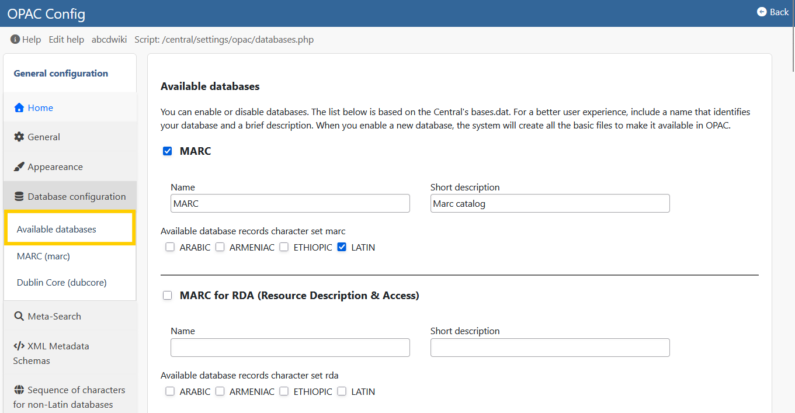

# Database Selection & Paths

Unlike the Central module, the OPAC does not automatically show all databases. You must explicitly "publish" them.

**Access:** **OPAC Configuration > Databases**

## 1. Available Databases
Use the **"Available Databases"** option to create the list of catalogs visible to the public.
* **Add:** Select a database from the server and give it a public name (e.g., "Main Collection").
* **Hide:** Remove a database from this list to make it invisible in the OPAC, even if it exists on the server.

## 2. Database Paths (`dr_path.def`)
The OPAC needs to know exactly where the images and full-text files for each database are stored. This is configured in the **DR_PATH** (Digital Resources Path).

* **ROOT:** The physical path on the server disk (e.g., `/var/www/html/ABCD/bases/books/`).
* **HTTP:** The web URL equivalent (e.g., `/docs/books/`).

:::danger Broken Images?
If book covers or PDFs are not showing up in the OPAC, it is almost always a configuration error in `dr_path.def`. Ensure the **HTTP** path matches your Apache/Virtual Host aliases.
:::

## 3. Record Export
You can configure which formats are available for users to download records (ISO 2709, RIS, Word).