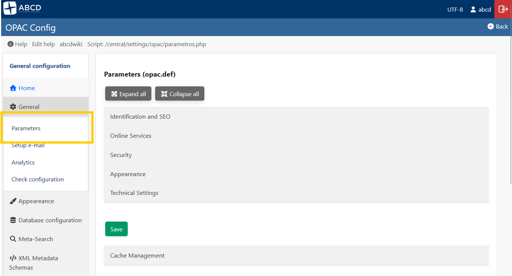
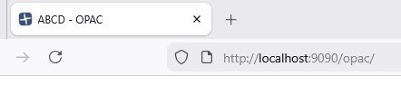
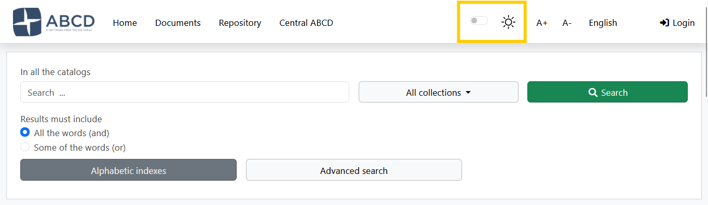
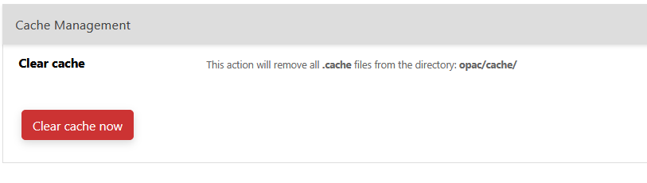

# System Architecture & Global Configuration

The ABCD OPAC is controlled by a hierarchy of configuration files. While advanced users can edit these files directly, the system provides a robust **Graphic Interface (GUI)** to manage global parameters, visual identity, and system cache.

## 1. Global Parameters (GUI)
**Access:** **General** > **Parameters** (`parametros.php`)

This interface is the primary way to configure the behavior and look of your portal. It saves changes directly to the `opac.def` file without requiring manual text editing.



### Visual Identity
* **Logo:** You can upload an image file (PNG, JPG) directly through the interface to replace the site logo.


* **Favicon (ShortIcon):** Upload the small icon displayed in the browser tab.


* **Styles (CSS):** Select the color scheme (e.g., `styles.css`, `dark.css`) from the dropdown menu.


* **Link Logo:** Define the URL where users are redirected when clicking the logo (usually the library homepage).

### Content & Text
* **Page Title:** The text displayed in the browser's title bar (e.g., "Central Library Catalog").
* **Footer Text:** A short text line for copyright or contact info appearing at the bottom of every page.

### Security & Technical
* **CAPTCHA:** Enable Google reCAPTCHA integration to protect forms against bots.
* **Charset:** Select the character encoding (UTF-8 or ISO-8859-1).
    * *Note:* This must match your database encoding to avoid character display errors (like `ã`).

---

## 2. Cache Management
**Access:** **Global Parameters** > **Cache Management** (Bottom of the page)

To improve performance, the OPAC caches search results, facet calculations, and configuration arrays in the `opac/cache/` directory.

### When to Clear Cache?
You should click the **"Clean Cache"** button if:
1.  You made changes to `opac.def` or `bases.dat` that are not appearing.
2.  You updated a PFT format, but records still show the old layout.
3.  The OPAC seems "stuck" on old search results.



* **Action:** The system deletes temporary files (`*.cache` and temp text files) ensuring that the next user request generates fresh data.

---

## 3. The Backend: `config_opac.php` & `opac.def`
Although the GUI handles most daily tasks, understanding the underlying files is crucial for troubleshooting and advanced architecture.

### The Bootloader: `config_opac.php`
Located in the root of the OPAC, this script initializes the environment.
* **`$db_path`**: The absolute path to the `bases` folder.
* **`$lang`**: The priority logic for language detection.
* **`$restricted_opac`**: Defines if the portal requires login (`Y`) to view the home page.

### The Configuration File: `opac.def`
The GUI described above writes to this INI file located in `bases/opac_conf/opac.def`.

**Example Content:**
```ini
[OPAC]
OpacHttp=http://localhost:9090/opac/
Logo=logoabcd.png
link_logo=[http://my-library.org](http://my-library.org)
TituloPagina=My Library Catalog
footer_text=© 2024 Library Systems
styles=styles.css
captcha=Y

```

:::warning URL Configuration
The parameter **`OpacHttp`** is critical. It must match your server's public URL exactly. If images break or AJAX searches fail, check this value in the file manually.
:::

---

## 4. The `opac_conf` Directory Structure

The `bases/opac_conf/` folder contains the "Global Configuration" assets that apply to all databases.

* **`bases.dat`**: The master list of databases available in the OPAC.
* **`lang.tab`**: Maps language codes (en, es, pt) to human-readable names.
* **`formatos.dat`**: Defines the output options (ISO, Word, Print) available in the toolbar.
* **`record_toolbar.tab`**: Controls which icons appear above records (Print, Reserve, etc.).
