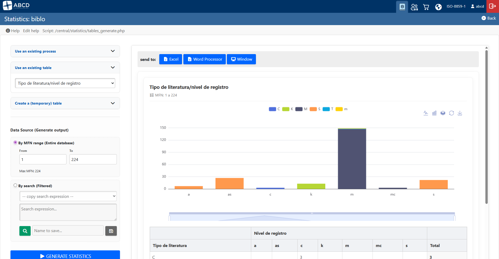
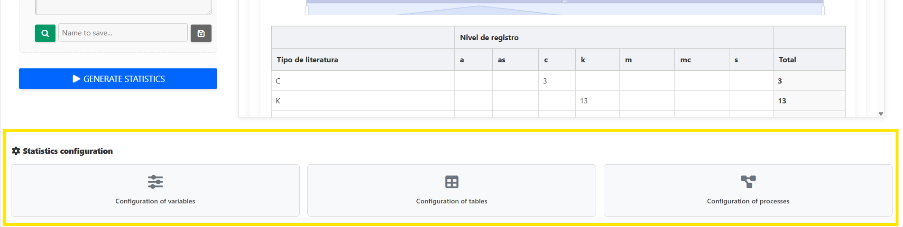
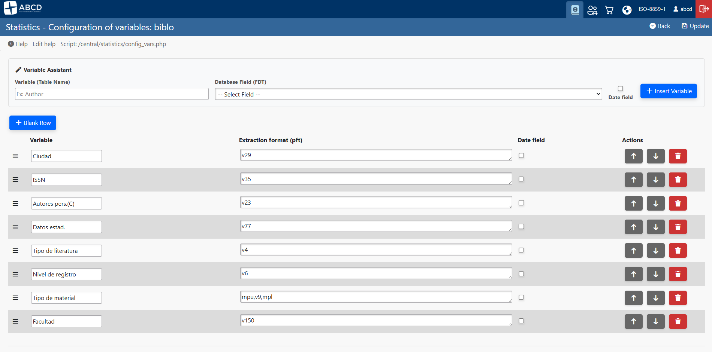
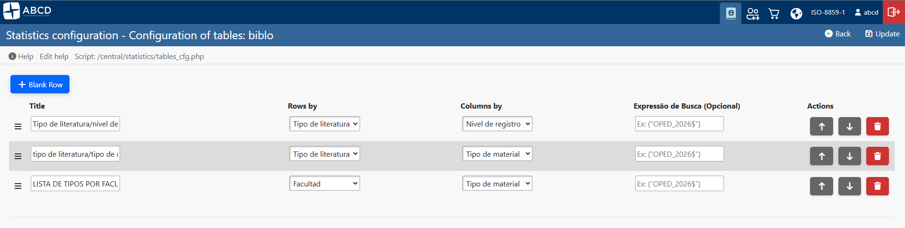
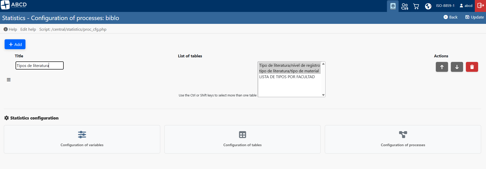

# Configuring Statistics

The Statistics module in ABCD is a powerful reporting engine that allows you to extract, cross-reference, and visualize data from your bibliographic databases. 

Because library data can be highly complex, generating a chart requires teaching the system how to organize this data. This is done in three sequential stages: defining **Variables**, building **Tables**, and grouping them into **Processes**.

**Access:** **Statistics > Configuration** (using the gear icon at the bottom of the Statistics Dashboard).

---

## 1. Defining Variables (`config_vars.php`)
A "Variable" is a specific piece of data extracted from a record (e.g., Author, Publication Year, Item Type). Variables are the building blocks of your reports.

1. Click on **Variables Configuration**.
2. To create a new variable, you can use the **Variable Assistant (Magic Wand)**:
   * **Variable Name:** Provide a clear, human-readable label (e.g., `Publication Year`).
   * **Database Field:** Select the field from the dropdown list (automatically populated from your database's FDT).
   * Click **Insert Variable** and then save.

**Advanced Configuration:** Instead of the assistant, administrators can manually add a "Blank Row" to define a variable using the ISIS Formatting Language (PFT). 
* *Example:* `v10^a` (Extracts subfield 'a' of tag 10).
* *Example:* `(v650/)` (Extracts all repeatable subjects on separate lines).

:::tip 
Administrator Note
Variables are reusable. Once you define "Location", you can use it as a Row or a Column in dozens of different tables without having to recreate it.
:::

---

## 2. Defining Tables (`tables_cfg.php`)
A "Table" defines the layout of a single report by crossing two variables (Rows × Columns).

1. Click on **Tables Configuration**.
2. Click **Add Table** to create a new row in the configuration matrix.
3. Fill in the parameters:
   * **Title:** The report header (e.g., `Items by Location and Year`).
   * **Rows By:** Select a variable for the Y-axis (e.g., `Location`).
   * **Cols By:** Select a variable for the X-axis (e.g., `Publication Year`). *Note: You can leave the Column variable empty to generate a simple Frequency List (Top list).*
   * **Search Expression (Optional):** This is a powerful filtering tool. You can input an ISIS search expression (e.g., `("OPED_2026$")`) to force this specific table to *only* process records matching this query. 

:::info 
Technical Insight: Table-Level Filtering
If you set a Search Expression here, the system will apply it exclusively to this table. This allows you to create comparative reports in a single dashboard (e.g., Table A shows "Records Created in 2026" while Table B shows "Records Edited in 2026"), even when they are generated simultaneously.
:::

---

## 3. Defining Processes (`proc_cfg.php`)
A "Process" is a collection of tables grouped together. Instead of making the operator generate ten different tables one by one, you can group them into a single "Monthly Report" process.

1. Click on **Processes Configuration**.
2. Click **Add Process**.
3. **Title:** Name the routine (e.g., `Team Production Dashboard`).
4. **Table List:** Hold `Ctrl` (or `Cmd` on Mac) and click to select multiple tables from the list of previously created tables.
5. Save the configuration.

:::info 
Technical Insight: The Multi-Loop Engine
In ABCD version 3.7.0+, the statistics module uses a "Multi-Loop Orchestrator". This means that when a Process is executed, the backend engine isolates each table and processes its specific PFT and specific Search Expression independently. This guarantees high-speed performance and zero data conflict between tables.
:::

---

## 4. Generating the Output (The Dashboard)
Once your Variables, Tables, and Processes are configured, operators can easily generate beautiful visual reports.

1. Go to the main **Statistics** menu.
2. Select your desired output from the accordion menu:
   * **1. Use an existing process** (Generates multiple tables at once).
   * **2. Use an existing table** (Generates a single predefined table).
3. Choose the **Data Source**:
   * **By MFN range:** Processes the entire database (or a specific slice of IDs).
   * **By search (Filtered):** Allows the operator to type a global search expression (e.g., `AU=Smith$`).
4. Click **GENERATE STATISTICS**.

**Transparency Feature:** The generated charts will display a subtitle indicating exactly which filters (MFN or Search Expressions) were applied to generate that specific graph, ensuring complete data governance and clarity for decision-makers.