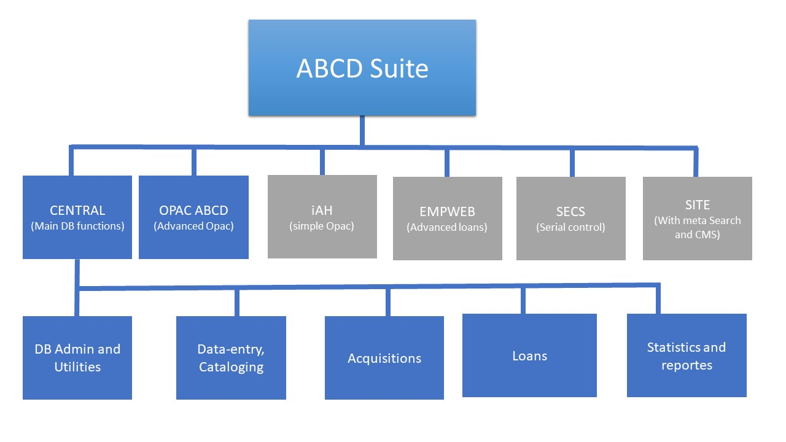
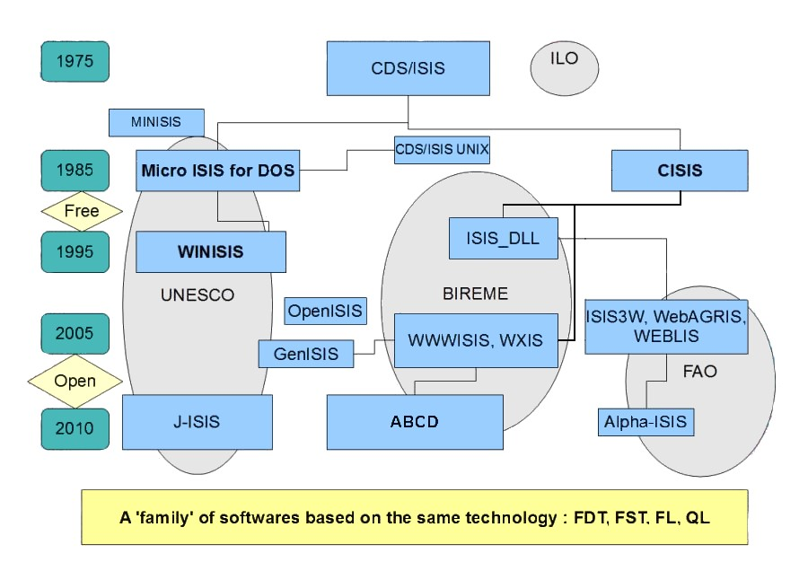

# Overview

ABCD is a suite of relatively independent modules that can cooperate fully or exist on their own. The main components are:

### The ABCD Central

The ‘Central’ module comprises the back-office functions of ABCD and includes:
* **Database Administration**: Create and define any number of new databases (similar to Winisis), including FDT, PFT, FST, and worksheets directly on the Web, or by copying from existing ones.
* **Cataloging**: For books and serials, independent of the format (MARC, LILACS, AGRIS, etc.). It also supports MARC-21 cataloging formats and other standards like Dublin Core and METS. A thesaurus management module is also being prepared.
* **Acquisitions**: Manages the acquisition process.
* **Circulation/Loans**: Handles loan circulation.
* **Statistics**: Provides statistical analysis.
* **Library Services**: Includes functionalities like Selective Dissemination of Information (SDI), barcode printing, and quality control.
* **Utilities**: Offers import/export services, printing, and database tools like record locking/unlocking and global changes.

This central part allows for the complete automation of a smaller library with all necessary functions, using only ISIS and PHP technology.

### The ABCD OPAC (Native)

ABCD has an integrated OPAC, with the possibility of searching multiple databases, results displayed with facets, multilingual. OPAC has an interactive internal configuration panel that reduces the need to manipulate files directly on the server.
This OPAC has a responsive layout with the possibility of enlarging fonts and high-contrast themes.

### The ABCD OPAC (iAH)

The public search interface, or Online Public Access Catalog (OPAC), is an adapted version of BIREME’s "advanced interface for Health information" (iAH). It allows end-users to perform meta-searches not only on local catalogs but also on many other information resources. The iAH interface is being upgraded to iAHx to align with modern Information Retrieval concepts and techniques, such as clustering and relevance ranking based on Lucene indexing.

### The ABCD Site

This module is a specific Content Management System (CMS) that allows for the design of the structure and components of the ABCD portal page. It presents the library's catalog(s) in a broader information context by providing access to other resources (e.g., Google, Medline) and communication tools (announcements, alerts), paving the way for ‘Web 2.0’-like functions.

### The ABCD OAI-PMH Data Provider

The ABCD suite includes a module that allows it to act as a data provider for the Open Archives Initiative Protocol for Metadata Harvesting (OAI-PMH) version 2.0. This recently rewritten and fully functional module promotes interoperability standards to facilitate the efficient dissemination of content from ABCD databases.

Any database within ABCD can be configured to be exposed through this protocol. The configuration is managed through a specific Formatting Language (PFT) file that maps the database fields to the Dublin Core metadata elements, which is the baseline format for OAI-PMH. This enables other systems and harvesters to retrieve the library's metadata, enhancing visibility and integration with other repositories.

## Architectural Characteristics

* **Platform**: Runs on both Windows and Linux platforms.
* **Database Technology**: Compatible with CDS/ISIS database technology, allowing it to read ISIS databases and use the ISIS Formatting Language. It is aligned with the CISIS/1660 version 5.2 platform, with inverted file entries of 60 characters.
* **Programming Languages**: Compatible with languages accepted by GNU licenses, such as PHP, Java, Javascript, and Python. The current version is written in PHP v.7 and IsisScript.
* **Protocols**: Supports standards and protocols like Z39.50.
* **Character Encoding**: Can be configured for Unicode (UTF-8) or ANSI (iso-8859-1).
* **Multi-lingual**: The product is available in Spanish, English, French, and Portuguese and can be translated into other languages.
* **Developer Tools**: Includes accompanying tools for the developer community.

### Relation with ISIS
ABCD 2.0 uses ISIS functionality and also ISIS software. ISIS has a large history and following picture gives an impression of this complicated story.

## New Features in ABCD v2.0 (Preview)

The following features are planned for or included in the new ABCD v2.0 and need to be fully integrated into the documentation:

* Use of different CISIS versions for database storage (e.g., CISIS-Unicode, BigISIS).
* A Digital Library feature for uploading and full-text indexing/searching of documents.
* A new module, ‘ODDS’, for Online Document Delivery Service.
* A new module for LDAP authority control.
* A new DSpace bridge script for automatic migration of a DSpace repository into ABCD.